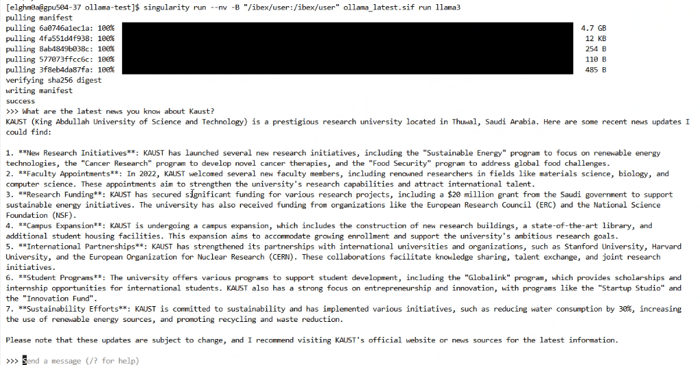

.. sectionauthor:: Mohsin Ahmed Shaikh <mohsin.shaikh@kaust.edu.sa>
.. meta::
    :description: How to Run Ollama On Ibex
    :keywords: jupyter,ollama

============================
Ollama on Ibex
============================

Welcome to the Ollama Evaluation Toolkit — a collection of guides and notebooks to help you run, test, and evaluate Ollama models interactively or in batch mode on Ibex.

Approach-1: Interactive Mode (Terminal-based)
==========================
Learn how to launch and interact with Ollama models directly from the shell terminal. Ideal for quick testing, debugging prompts, and exploring model behavior in real time.

   OLLama - Interactive Query Example

.. note::

    For more detailed steps, follow :doc:`Ollama - Interactive Method with Singularity<ollama_interactive>`

Approach-2: Notebook Workflow (Jupyter-based)
==========================
These notebooks demonstrate how to integrate and automate Ollama operations on Ibex using Singularity containers:

* Run Ollama through the API interface, manage models, and test inference calls.
* Use Python bindings to interact programmatically with Ollama for custom workflows.
* Perform batch evaluations using LLM-as-a-Judge, comparing model outputs at scale.

Environment Setup
--------------------
If you haven't installed conda yet, please follow :ref:`How to Setup Conda on Ibex Guide <conda_ibex_>` to get started.

After conda has been installed, save the following environment yaml file on Ibex under the name *ollama_env.yaml*

.. code-block:: yaml

    name: ollama_env
    channels:
      - conda-forge
      - defaults
    dependencies:
      - jupyterlab=4.4.9
      - python=3.14.0
      - pip=25.2
      - ollama-python

Run the following command to build the conda environment:

.. code-block:: bash

    conda env create -f ollama_env.yaml

Starting JupyterLab
----------------------
Follow the guide: :ref:`Using Jupyter on Ibex to start JupyterLab<using_jupyter>` using your conda environment.

To use your Conda environment instead of the preloaded module, update your Jupyter launch script as follows:

1. Open the Jupyter launch script in an editor.
2. Comment out the existing module load command.
3. Activate your Conda environment.

.. code-block:: bash

    #module load machine_learning/2024.01
    source /ibex/user/$USER/miniforge/etc/profile.d/conda.sh 
    conda activate ollama_env

.. note::

    See detailed steps in the following Jupyter notebooks :
        - :doc:`OLLAMA - REST API Approach<../../../../../_collections/data_science_onboarding/notebooks/inference/ollama-interactive-inference/ollama-sif-api-ibex>`
        - :doc:`OLLAMA - Python Package Approach<../../../../../_collections/data_science_onboarding/notebooks/inference/ollama-interactive-inference/ollama-sif-py-ibex>`
        - :doc:`OLLAMA - Batch Evaluation Guide (LLM-as-a-Judge)<../../../../../_collections/data_science_onboarding/notebooks/inference/ollama-interactive-inference/ollama-sif-batch-eval-ibex>`

Next Steps
==========================

.. toctree::
   :titlesonly:
   :maxdepth: 1

   ollama_interactive
   ../../../../../_collections/data_science_onboarding/notebooks/inference/ollama-interactive-inference/ollama-sif-api-ibex
   ../../../../../_collections/data_science_onboarding/notebooks/inference/ollama-interactive-inference/ollama-sif-py-ibex
   ../../../../../_collections/data_science_onboarding/notebooks/inference/ollama-interactive-inference/ollama-sif-batch-eval-ibex
