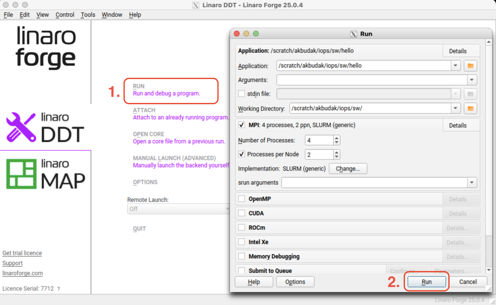
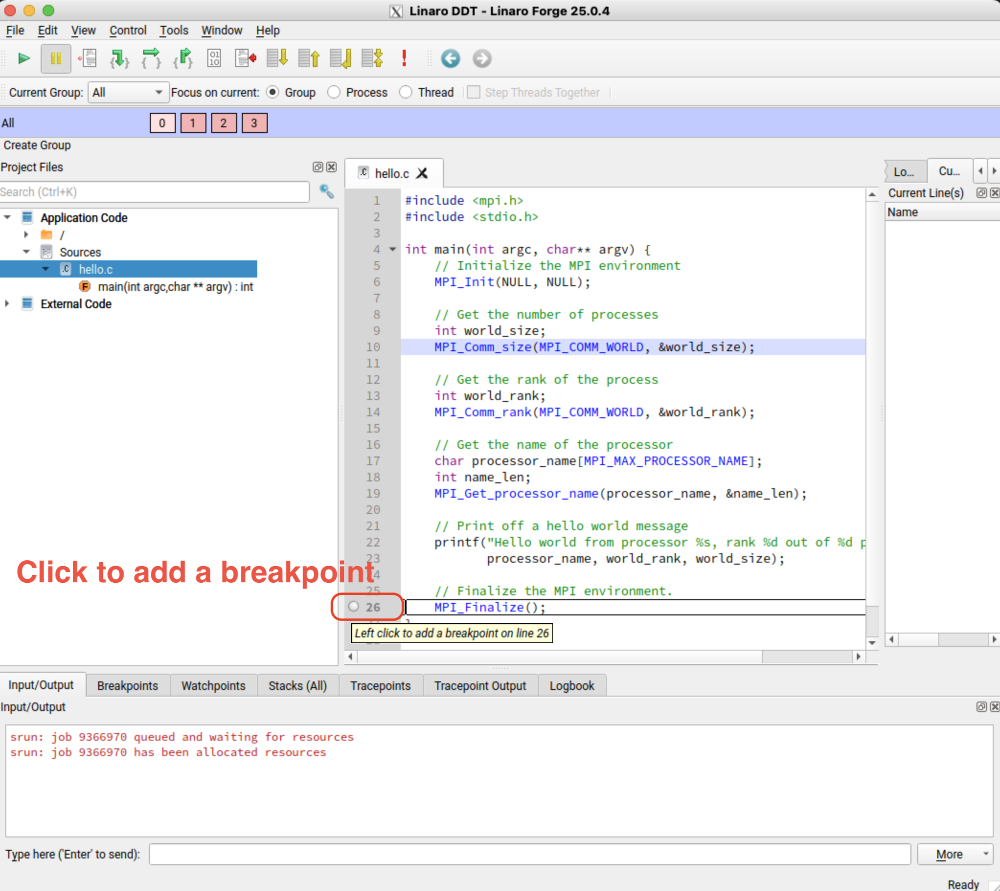
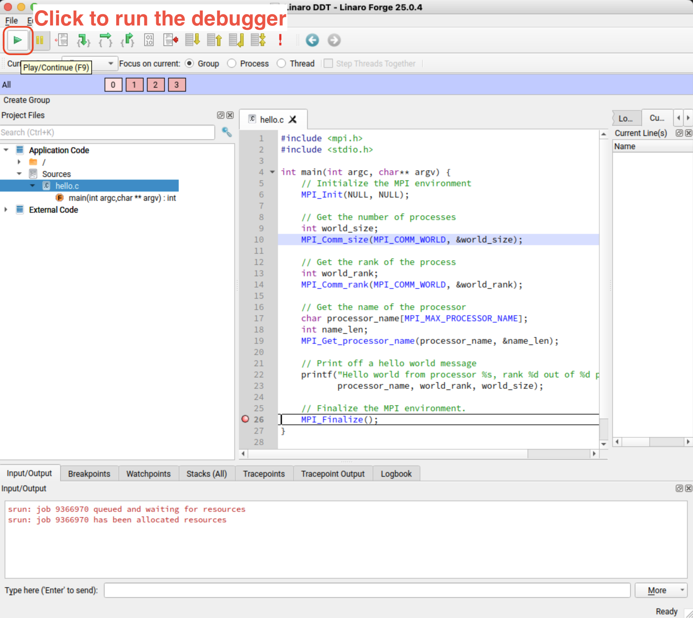

.. sectionauthor:: Kadir Akbudak <kadir.akbudak@kaust.edu.sa>
.. meta::
    :description: ddt
    :keywords: debugging,linaro,ddt,debugger

.. _ddt:

***********
Linaro DDT
***********

`Linaro DDT <https://docs.linaroforge.com/25.1/html/forge/ddt/get_started_ddt/index.html>`_ is used to debug parallel applications with multiple MPI ranks.

.. note::
    Please do not forget to add ``-g`` as a flag during compilation of your source to get the line information in the debugger.

The debugger can be run as follows:

.. code-block:: bash

    $ ssh -XY shaheen.hpc.kaust.edu.sa
    $ module load arm-forge
    $ ddt

The GUI of the debugger will open as seen below. 
You need to click "RUN (Run and debug a program)". 
A new pop-up window will open.
In this pop-up window, you enter the whole path to the executable that will be debugged.
You can set the total number of processes and the number of processes per node.
You can also set other SLURM-related parameters that you are using in your regular SLURM jobs.
You click the "Run" button.

You can add breakpoints as seen below.

You start debugging by pressing the play button as seen below.

