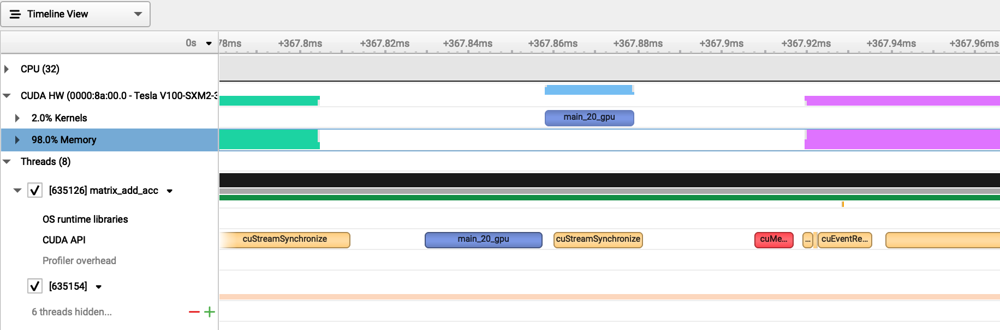

.. sectionauthor:: Kadir Akbudak <kadir.akbudak@kaust.edu.sa>
.. meta::
    :description: Nsight-OpenACC
    :keywords: nsight, openacc

.. _nsight_cpp_openacc:

===============================================================
Profiling C++ code with OpenACC directives using Nsight Systems
===============================================================

Nsight Systems can be used to profile OpenACC workloads.

The following C++ code adds two matrices and writes the result into a new matrix using OpenACC.
This code can be saved in a file named ``matrix_add_acc.cu``.

.. code-block:: cpp

 #include <iostream>
 #include <cstdlib>

 #define N 1024  // Matrix size N x N

 int main() {
     // Allocate memory
     float* A = new float[N * N];
     float* B = new float[N * N];
     float* C = new float[N * N];

     // Initialize matrices
     for (int i = 0; i < N * N; ++i) {
         A[i] = 1.0f;
         B[i] = 2.0f;
     }

     // Offload to GPU using OpenACC
     #pragma acc data copyin(A[0:N*N], B[0:N*N]) copyout(C[0:N*N])
     {
         #pragma acc parallel loop collapse(2)
         for (int i = 0; i < N; ++i) {
             for (int j = 0; j < N; ++j) {
                 int idx = i * N + j;
                 C[idx] = A[idx] + B[idx];
             }
         }
     }

     // Print sample output
     std::cout << "Matrix addition complete. C[0] = " << C[0] << std::endl;

     // Cleanup
     delete[] A;
     delete[] B;
     delete[] C;

     return 0;
 }

The following SLURM job script compiles ``matrix_add_acc.cu``, runs the Nsight Systems profiler, and collects performance data.
This script can be saved in a file named ``matrix_add_acc.slurm``.

.. code-block:: bash

 #!/bin/bash -l
 #SBATCH --time=00:30:00
 #SBATCH --gres=gpu:1
 #SBATCH --constraint=v100
 module load nvidia-sdk
 nvc++ -acc -Minfo=accel -o matrix_add_acc matrix_add_acc.cu
 nsys profile -o profile.${SLURM_JOBID} ./matrix_add_acc

The following steps show how to submit ``matrix_add_acc.slurm`` on Ibex:

.. code-block:: bash

   ssh glogin.ibex.kaust.edu.sa
   sbatch matrix_add_acc.slurm

The output of the profiler is recorded in a file named ``profile.<SLURM_JOBID>.nsys-rep``.
This file can be copied to a local machine and examined.
The following command can be used to find out the version of the Nsight Systems:

.. code-block:: bash

 nsys --version

The same version of the Nsight Systems can be downloaded from `here <https://developer.nvidia.com/nsight-systems>`_ to run on the local machine.

The following trace of execution shows the GPU device (V100) and a couple of CPU threads.
The two input matrices are allocated and prepared on the CPU.
There is an OpenACC region containing the addition operation to be offloaded to the GPU.
The OpenACC directive indicates that the input matrices ``A`` and ``B`` will be copied to the GPU before the operation on the GPU starts.
These copy operations are indicated by the ``copyin`` keyword in the OpenACC directive.
This region is shown as green in the following trace.
The matrix addition loop in the C++ code is translated to a GPU kernel by the compiler.
This kernel for the matrix addition operation runs afterwards and this duration is displayed as blue in the trace.

After the kernel finishes, the resultant matrix is copied back to the host as the OpenACC directive states by the keyword ``copyout``..
This region is shown as pink.
In conclusion, the device must be kept busy with computations displayed as blue.
Having copy operations or empty areas in this trace means low utilization of the device.

