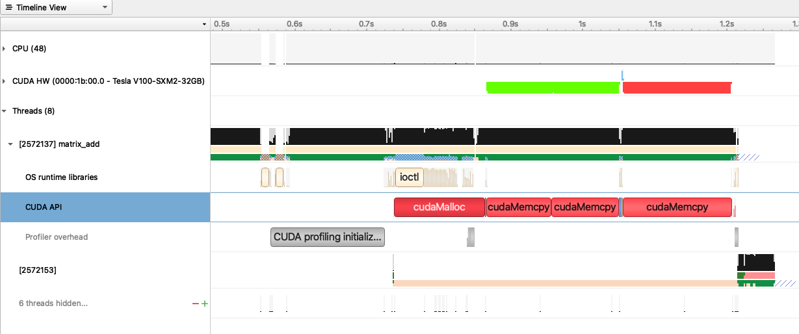

.. sectionauthor:: Kadir Akbudak <kadir.akbudak@kaust.edu.sa>
.. meta::
    :description: Nsight-CUDA
    :keywords: nsight, cuda

.. _nsight_nvtx:

==================================================
Profiling a basic CUDA kernel using NSight Systems
==================================================

NSight Systems can be used to profile CUDA code.

The following C++ code adds two matrices and writes the result into a new matrix.
This code can be saved in a file named ``matrix_add.cu``.

.. code-block:: cpp

 #include <iostream>
 #include <cuda_runtime.h>

 #define N 10240  // Matrix size N x N

 __global__ void matrixAdd(const float* A, const float* B, float* C, int width) {
     int row = blockIdx.y * blockDim.y + threadIdx.y;
     int col = blockIdx.x * blockDim.x + threadIdx.x;
     if (row < width && col < width) {
         int idx = row * width + col;
         C[idx] = A[idx] + B[idx];
     }
 }

 void checkCuda(cudaError_t result, const char *msg) {
     if (result != cudaSuccess) {
         std::cerr << "CUDA Error: " << msg << ": " << cudaGetErrorString(result) << std::endl;
         exit(EXIT_FAILURE);
     }
 }

 int main() {
     size_t size = N * N * sizeof(float);

     // Allocate host memory
     float* h_A = new float[N * N];
     float* h_B = new float[N * N];
     float* h_C = new float[N * N];

     // Initialize input matrices
     for (int i = 0; i < N * N; ++i) {
         h_A[i] = 1.0f;
         h_B[i] = 2.0f;
     }

     // Allocate device memory
     float *d_A, *d_B, *d_C;
     checkCuda(cudaMalloc((void**)&d_A, size), "cudaMalloc A");
     checkCuda(cudaMalloc((void**)&d_B, size), "cudaMalloc B");
     checkCuda(cudaMalloc((void**)&d_C, size), "cudaMalloc C");

     // Copy data from host to device
     checkCuda(cudaMemcpy(d_A, h_A, size, cudaMemcpyHostToDevice), "cudaMemcpy A");
     checkCuda(cudaMemcpy(d_B, h_B, size, cudaMemcpyHostToDevice), "cudaMemcpy B");

     // Launch kernel
     dim3 threadsPerBlock(16, 16);
     dim3 blocksPerGrid((N + threadsPerBlock.x - 1) / threadsPerBlock.x,
                        (N + threadsPerBlock.y - 1) / threadsPerBlock.y);

     matrixAdd<<<blocksPerGrid, threadsPerBlock>>>(d_A, d_B, d_C, N);
     checkCuda(cudaDeviceSynchronize(), "Kernel execution");

     // Copy result back to host
     checkCuda(cudaMemcpy(h_C, d_C, size, cudaMemcpyDeviceToHost), "cudaMemcpy C");

     std::cout << "Matrix addition complete. Sample: C[0] = " << h_C[0] << std::endl;

     // Cleanup
     delete[] h_A;
     delete[] h_B;
     delete[] h_C;
     cudaFree(d_A);
     cudaFree(d_B);
     cudaFree(d_C);

     return 0;
 }

The following SLURM job script compiles ``matrix_add.cu``, runs the NSight Systems profiler, and collects performance data.
This script can be saved in a file named ``matrix_add.slurm``.

.. code-block:: bash

 #!/bin/bash -l
 #SBATCH --time=00:10:00
 #SBATCH --gres=gpu:1
 #SBATCH --constraint=v100
 module load nvidia-sdk
 cmd="matrix_add"
 nvcc -o $cmd matrix_add.cu
 nsys profile -o profile.${SLURM_JOBID} ${cmd}

The following steps show how to submit ``matrix_add.slurm`` on Ibex:

.. code-block:: bash

   ssh glogin.ibex.kaust.edu.sa
   sbatch matrix_add.slurm

The output of the profiler is recorded in a file named ``profile.<SLURM_JOBID>.nsys-rep``.
This file can be copied to a local machine and examined.
The following command can be used to find out the version of the NSight Systems:

.. code-block:: bash

 nsys --version

The same version of the NSight Systems can be downloaded from `here <https://developer.nvidia.com/nsight-systems>`_ to run on the local machine.

The following trace of execution shows the GPU device (V100) and a couple of CPU threads.
The two input matrices are prepared on the CPU and then copied to the device.
This region is shown as green.
The CUDA kernel for matrix addition runs afterwards and this duration is displayed in blue color.
After the kernel finishes, the resultant matrix is copied to the host.
This region is shown as red.
In conclusion, the device must be kept busy with computations displayed as blue.
Having copy operations or empty areas in this trace means low utilization of the device.

