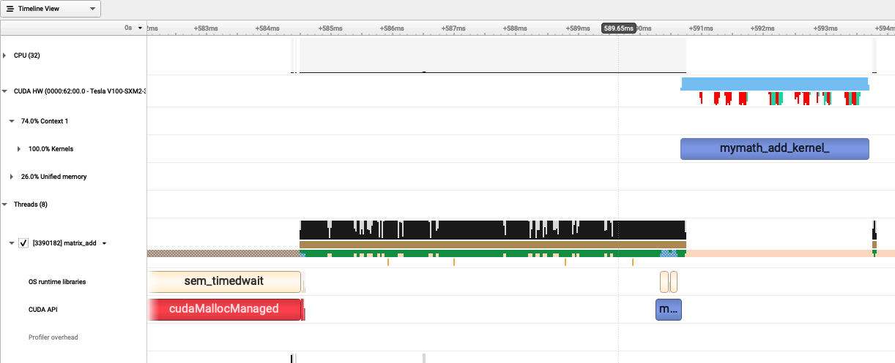

.. sectionauthor:: Kadir Akbudak <kadir.akbudak@kaust.edu.sa>
.. meta::
    :description: Nsight-CUDA-Fortran
    :keywords: nsight, cuda, fortran

.. _nsight_fotran:

===============================================================
Profiling a CUDA kernel written in Fortran using NSight Systems
===============================================================

NSight Systems can be used to profile CUDA code.

The following C++ code adds two matrices and writes the result into a new matrix.
CUDA unified memory is used in the code.
This code can be saved in a file named ``matrix_add.cuf``.

.. code-block:: fortran

 module myMath
 contains
   ! Kernel declaration
   attributes(global) subroutine add_kernel(A, B, C, N)
     real, managed :: A(N, N), B(N, N), C(N, N)
     integer, value :: N
     integer :: i, j

     i = (blockIdx%x - 1) * blockDim%x + threadIdx%x
     j = (blockIdx%y - 1) * blockDim%y + threadIdx%y

     if (i <= N .and. j <= N) then
       C(i, j) = A(i, j) + B(i, j)
     end if
   end subroutine add_kernel
 end module myMath

 program matrix_add
   use myMath
   use cudafor
   implicit none

   integer :: istat
   integer, parameter :: N = 1024
   real, managed :: A(N, N), B(N, N), C(N, N)

   integer :: i, j
   type(dim3) :: gridDim, blockDim

   ! Initialize input matrices on host
   do j = 1, N
     do i = 1, N
       A(i, j) = 1.0
       B(i, j) = 2.0
     end do
   end do

   ! Define block and grid dimensions
   blockDim = dim3(16, 16, 1)
   gridDim  = dim3((N+15)/16, (N+15)/16, 1)

   ! Launch kernel
   call add_kernel<<<gridDim, blockDim>>>(A, B, C, N)
   istat = cudaDeviceSynchronize()

   ! Print a sample result
   print *, "Matrix addition complete."
   print *, "Result C(1:10,1:10):"
   do i = 1, min(N, 10)
     write(*, '(10F10.3)') (C(i, j), j = 1, min(N, 10))
   end do
 end program matrix_add

The following SLURM job script compiles ``matrix_add.cuf``, runs the NSight Systems profiler, and collects performance data.
This script can be saved in a file named ``matrix_add.slurm``.

.. code-block:: bash

 #!/bin/bash -l
 #SBATCH --time=00:10:00
 #SBATCH --gres=gpu:1
 #SBATCH --constraint=v100
 module load nvidia-sdk
 nvfortran -cuda -o matrix_add matrix_add.cuf
 nsys profile -o profile.${SLURM_JOBID} matrix_add

The following steps show how to submit ``matrix_add.slurm`` on Ibex:

.. code-block:: bash

   ssh glogin.ibex.kaust.edu.sa
   sbatch matrix_add.slurm

The output of the profiler is recorded in a file named ``profile.<SLURM_JOBID>.nsys-rep``.
This file can be copied to a local machine and examined.
The following command can be used to find out the version of the NSight Systems:

.. code-block:: bash

 nsys --version

The same version of the NSight Systems can be downloaded from `here <https://developer.nvidia.com/nsight-systems>`_ to run on the local machine.

The following trace of execution shows the GPU device (V100) and a couple of CPU threads.
The two input matrices are allocated on the CPU memory (shown as ``cudaMallocManaged`` in red color) and initialized on the CPU.
During the execution of the CUDA kernel for matrix addition, host-to-device memory operations (colored in red and light green) are observed.
This is because unified memory is used and the kernel tries to access to the matrices on the host memory.
The duration of the kernel execution on the device is shown in blue.
In conclusion, the device must be kept busy with computations displayed as blue.
However, the data movements must be minimized or completely removed if possible.

