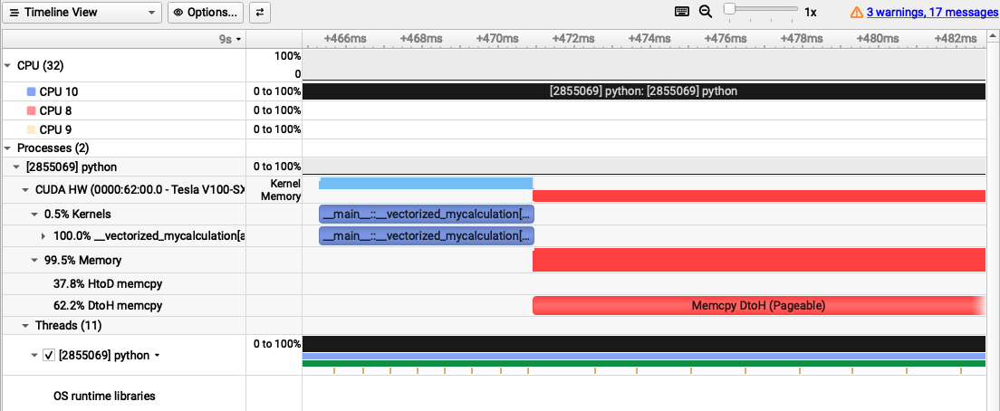

.. sectionauthor:: Kadir Akbudak <kadir.akbudak@kaust.edu.sa>
.. meta::
    :description: Nsight-CUDA
    :keywords: nsight, cuda

.. _nsight_numba_vectorize:

=============================================================
Profiling a CUDA Ufunc written in Python using Nsight Systems
=============================================================

Nsight Systems can be used to profile a CUDA Ufunc written in Python.

The following Python code have a function named ``mycalculation()``.
This function takes one real number as a parameter, does some arbitrary calculations, and returns a value.
The ``@vectorize`` decorator turns this function into a `ufunc <https://nvidia.github.io/numba-cuda/user/ufunc.html>`_, which can run on an Numpy array.
This ufunc is also a CUDA ufunc and runs on GPU because ``target=cuda`` parameter is passed to this ``@vectorize`` decorator.
This code can be saved in a file named ``numba_example.py``.

.. code-block:: python

 import math
 import numpy as np
 from numba import vectorize

 # This function takes a scalar and performs
 # arbitrary calculations and returns a scalar.
 # The vectorize decorator converts this function
 # into a ufunc that can also run on a GPU.
 @vectorize(["float64(float64)"], target="cuda")
 def mycalculation(x):
     a = math.sin( x ** 2 )
     b = math.exp( -a )
     c = math.sqrt( abs( x ) )
     d = c * math.tanh( x )
     e = b / d
     f = math.sqrt( abs( e ) )
     return f

 # Size of the array X
 N=1024*1024*256
 # Generate X randomly
 X = np.random.randn(N).astype(np.float64)
 print(X[0:4])
 # Perform computation on GPU
 K = mycalculation(X)
 print(K[0:4])

The following SLURM job script runs the Nsight Systems profiler, and collects performance data.
This script can be saved in a file named ``numba.slurm``.

.. code-block:: bash

 #!/bin/bash -l
 #SBATCH --time=00:10:00
 #SBATCH --gres=gpu:1
 #SBATCH --constraint=v100
 module load nvidia-sdk
 nsys profile -o profile.${SLURM_JOBID} python ./numba_example.py

The following steps show how to submit ``numba.slurm`` on Ibex:

.. code-block:: bash

   ssh glogin.ibex.kaust.edu.sa
   sbatch numba.slurm

The output of the profiler is recorded in a file named ``profile.<SLURM_JOBID>.nsys-rep``.
This file can be copied to a local machine and examined.
The following command can be used to find out the version of the Nsight Systems on Ibex:

.. code-block:: bash

 nsys --version

The same version of the Nsight Systems can be downloaded from `here <https://developer.nvidia.com/nsight-systems>`_ to run on the local machine.

The following trace of execution shows the utilization of the GPU device (V100) and a couple of CPU cores.
The input array ``X`` is prepared on the CPU and then copied to the device.
This copy is listed as "HtoD memcpy" on the left, which corresponds to host to device memory copy.
This copy operation takes 37.8% of the overall time.
This part of execution is not shown in this image.
However, it would be shown as green when zoomed out in the Nsight profiler.
The CUDA kernel for ``mycalculation`` runs afterwards and this duration is displayed in blue color.
The computation takes 0.5% of the overall time.
After the kernel finishes, the resultant array is copied back to the host.
This region is shown as red and annotated as "Memcpy DtoH" in the trace.
This copy operation takes 62.2% of the overall time.
In conclusion, the device must be kept busy with computations displayed as blue.
Having copy operations or empty areas in this trace means low utilization of the device.

