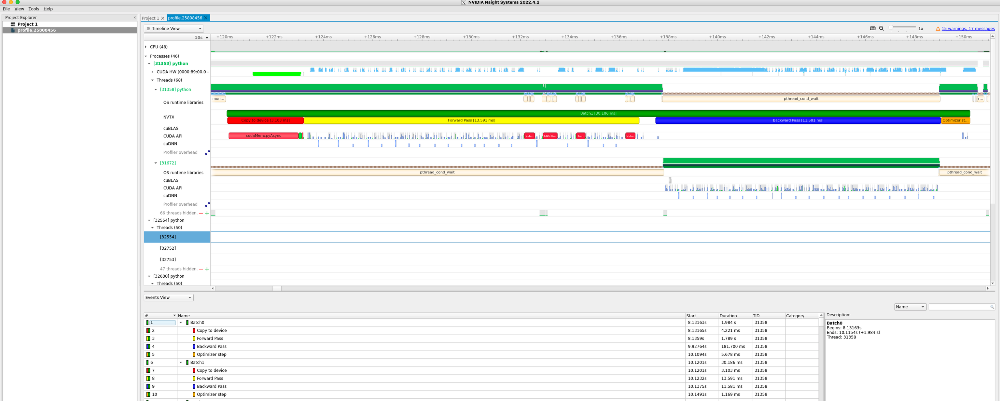

.. sectionauthor:: Mohsin Ahmed Shaikh <mohsin.shaikh@kaust.edu.sa>
.. meta::
    :description: Nsight-NVTX
    :keywords: nsight, nvtx

.. _nsight_nvtx:

=========================================
Nsight-systems with NVTX instrumentation
=========================================
In a typical epoch of DL training, multiple mini-batches are trained, and often it is tricky to demarcate a mini-batch where it ends and the next one starts. NVIDIA Tools Extension or NVTX is a way to instrument your training script to annotate different operations of the training of a mini-batch. The code requires minimal change:

  * If you are using the machine learning model, you can directly add this line to your code 

.. code-block:: bash
    
    #load nvtx package
    import nvtx

Annotate various operations of your training process

.. code-block:: bash 
   
    for epoch in range(5):
    for i, (images, labels) in enumerate(train_loader):
        with nvtx.annotate("Batch" + str(i), color="green"):
        
            #load images and labels to device
            with nvtx.annotate("Copy to device", color="red"):
                images, labels = images.to(device), labels.to(device)

            # Forward pass
            with nvtx.annotate("Forward Pass", color="yellow"):
                outputs = model(images)

            # Calculate the loss
            loss = criterion(outputs, labels)

            # Backpropagate the loss
            optimizer.zero_grad()

            with nvtx.annotate("Backward Pass", color="blue"):
                loss.backward()

            with nvtx.annotate("Optimizer step", color="orange"):
                optimizer.step()

|

To instruct ``nsys`` profiler to collect the annotated profile in the training loop, the launch command will add ``nvtx`` tracer.

.. code-block:: bash
    
    nsys profile --trace='cuda','cublas','cudnn','osrt','nvtx' --stats='true' --sample=none --export=sqlite -o profile.${SLURM_JOBID} ${cmd}

Upon visualizing, you can see an annotated training profile that is easier to track with the labels and colors you selected on the script 

