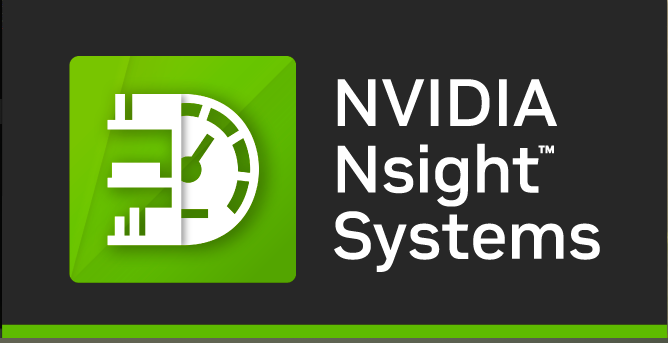
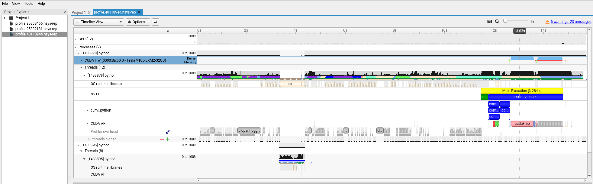

.. sectionauthor:: Didier Barradas Bautista <didier.barradasbautista@kaust.edu.sa>
.. meta::
    :description: Nsight-systems
    :keywords: nsight, nvtx , RAPIDS

.. _nsight_systems:

=========================================
RAPIDS and NSight Systems
=========================================

NSight Systems is a versatile tool that can help profile any workloads that uses GPU(s) and identify the hotspots of optimization. The NVTX profiling API can also be used to annotate your code with events. NSight Systems can display these annotated regions. This can help identify specific areas of your code that are causing performance problems.

The following documentation will show how to profile a deep learning workload. The example scripts can be downloaded at `here <https://github.com/D-Barradas/GPU_profiling_ibex>`_. You can check the src folder and find ``rapids_tsne.py`` , ``rapids_tsne.sh``. 

Quick Start
============

To collect the profiling information, submit a job as follows. This is the same job as in nsight-nvtx , but using Nsight Systems to profile a TSNE dimetion reduction using the RAPIDS cuML library.

.. code-block:: bash

    #!/bin/bash
    #SBATCH --job-name=Nsys_rapids_tsne
    #SBATCH --output=rapids_tsne_output.%j.out
    #SBATCH --error=rapids_tsne_error.%j.err
    #SBATCH --time=00:30:00
    #SBATCH --gres=gpu:1
    #SBATCH --constraint=v100
    #SBATCH --ntasks=1
    #SBATCH --cpus-per-task=8

    module load machine_learning
    module load nvidia-sdk/nvhpc/25.5

    cmd="python ./rapids_tsne.py"
    nsys profile --trace='cuda','cublas','cudnn','osrt','nvtx' --stats='true' --sample=none --export=sqlite -o profile.${SLURM_JOBID} ${cmd}

The above jobscript launches our python training using ``nsys`` profiler. Notice that we are loading the machine learning module and the nvidia-sdk module. As options, the command line also accepts the tracers you would like to use to trace different API calls by your code. In the jobscript above, we are choosing to trace ``cuda,cublas,cudnn`` API calls, and also ``osrt`` or OS Runtime calls (e.g. I/O calls). ``--stats=true`` allows printing a concise report in your SLURM output file for quick examination. In addition to this, the jobscript also instructs ``nsys`` to export the output collected and a SQLlite database which the Nsight-systems visual tool can easily search.

.. note::
    To launch the visualization of the profile on ibex glogin node (required OpenGL support)

.. code-block:: bash

    nsys-ui profile.40118944.nsys-rep

Where ``profile.40118944.nsys-rep`` is our profile.

The output is a stacked time series of all the resources and events traced. Hover your mouse on the event profile bar of ``CUDA HW(0000:8a:00.0-Tesla V100-SXM2-32GB)`` and you will notice how busy you GPU has been. The time series can be zoomed in to inspect the events at short time scales down to micro, even nanoseconds.  You can expand the above tab to show more event in finer granularity to see timing and sequence of different kernels. (Right click on ``CUDA HW(0000:b2:00.0Tesla V100-SXM2-32GB)`` tab and choose ``Show in Events View`` to inspect the table of the kernels profiled).

Adding the NVTX instrumentation
===============================
NVIDIA Tools Extension or NVTX is a way to instrument your training script to annotate different operations. The code requires minimal change:

  * If you are using the machine learning model, you can directly add this line to your code

.. code-block:: python

    #load nvtx package
    import nvtx

Annotate various operations of your training process. you can decorate complete funtions or use the context manager to annotate a block of code. For example, you can annotate the function as follows:

.. code-block:: python

    # Use the nvtx package to annotate the TSNE operation for profiling
    @nvtx.annotate("TSNE", color="blue")
    def run_tsne(X, n_components=2, perplexity=30.0, n_iter=1000):
        """
        Run t-SNE on the dataset using RAPIDS cuML implementation.
        Parameters:
            X: Input data
            n_components: Number of dimensions for embedding
            perplexity: t-SNE perplexity parameter
            n_iter: Number of optimization iterations
        Returns:
            Embedded data in lower dimensions
        Note:
            # of Nearest Neighbors should be at least 3 * perplexity.
        """
        n_neighbors = max(90, int(3 * perplexity))  # Ensure n_neighbors >= 3 * perplexity
        tsne = TSNE(n_components=n_components, perplexity=perplexity, n_iter=n_iter,
                random_state=23, method='fft', n_neighbors=n_neighbors)
        X_embedded = tsne.fit_transform(X)
        return X_embedded   

Or you can use the context manager to annotate a block of code:

.. code-block:: python

    with nvtx.annotate("Main Execution", color="yellow"):
        # Load the Fashion-MNIST dataset from the specified directory
        X, y = load_mnist_train('data/fashion')

        # Run t-SNE dimensionality reduction on the dataset
        X_embedded = run_tsne(X, n_components=2, perplexity=30.0, n_iter=1000)

        # Print the shape of the embedded data and the first 5 points for inspection
        print("Shape of embedded data:", X_embedded.shape)
        print("First 5 embedded points:\n", X_embedded[:5])

