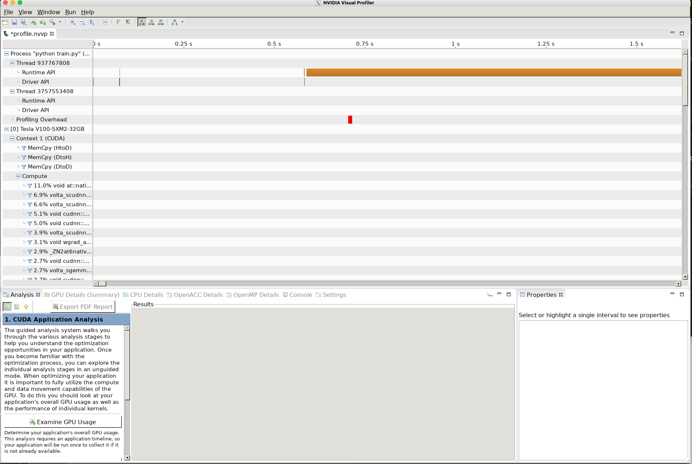

Using nvprof
------------
nvprof is a popular profiling tool that can profile GPU workloads on NVIDIA GPUs. It is bundled with the CUDA toolkit and can be used from the command line or in a jobscript. When used in a jobscript, an output file with the ``.nvvp`` extension is created at the end of the profile. This file can then be opened in NVIDIA's Visual Profiler ``nvvp``.

The following is an example jobscript to generate the profile. The training script trains ``resnet50`` from scratch using `tiny imagenet <https://tiny-imagenet.herokuapp.com/>`_ (200 classes) for 1st epoch. 

.. note::
 This script uses three modules available on ibex  :

  * ``dl``  ← this module will allow you to access different version of pytorch 

  * ``pytorch/1.9.0``  ← this a pytorch from source for ibex

  * ``torchvision`` ← same as before

 Beware of changes as the software stack is always evolving , so adjust the script to your needs

.. code-block:: bash

    #!/bin/bash --login
    #SBATCH --time=00:10:00
    #SBATCH --nodes=1
    #SBATCH --gpus-per-node=1
    #SBATCH --cpus-per-gpu=8
    #SBATCH --constraint=v100
    #SBATCH --partition=batch 
    #SBATCH --job-name=nvprof
    #SBATCH --mail-type=ALL
    #SBATCH --output=%x-%j-slurm.out
    #SBATCH --error=%x-%j-slurm.err 

    module load dl torchvision pytorch/1.9.0

    cmd="python ./train.py"
    nvprof profile.${SLURM_JOBID}.nvvp ${cmd}

Inside the file  ``%x-%j-slurm.out`` you will find the notification that NVPROF is going to profile the application you have launched:

.. code-block:: bash

    ==124733== NVPROF is profiling process 124733, command: python train.py
    device:  cuda:0
    /sw/csgv/dl/apps/pytorch/1.9.0/lib/python3.7/site-packages/torch/nn/functional.py:718: UserWarning: Named tensors and all their associated APIs are an experimental feature and subject to change. Please do not use them for anything important until they are released as stable. (Triggered internally at  ../c10/core/TensorImpl.h:1153.)
      return torch.max_pool2d(input, kernel_size, stride, padding, dilation, ceil_mode)
    Epoch 1, batch 1/1563, loss: 7.122538089752197
    ..
    Epoch 1, batch 1501/1563, loss: 5.0063157081604
    Val accuracy: 0.003
    Epoch 2, batch 1/1563, loss: 4.820196628570557
    ..
    Epoch 2, batch 1501/1563, loss: 4.754003047943115
    Val accuracy: 0.0353
    Test accuracy: 0.0327
    ==124733== Generated result file: /ibex/user/barradd/ksl_postmaint_tests/nvprof_cuda/profile.1234.nvvp

The output of the jobscript is a file called ``profile.${SLURM_JOBID}.nvvp``. This file can be opened in NVIDIA's Visual Profiler nvvp to view the profile of the training script.

.. note::
    To launch the visualization of the profile on ibex ``glogin`` node (required OpenGL support) and the same three modules loaded

.. code-block:: bash
   
    nvvp 

This will trigger the usual windows that will allow you to select your profile file 

.. image:: nvidia.png 
  :width: 10000
  :alt: Alternative text

|

.. image:: nvidia-visual-prof.png
  :width: 10000
  :alt: Alternative text

| 

.. note::
    Then you will see a GUI opening that will allow exploring different parts of the process you ran:     

|

