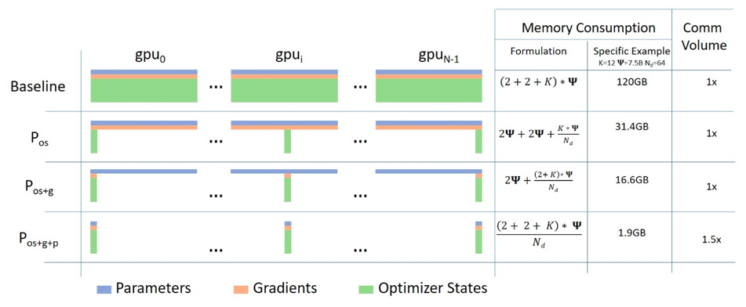

Deep Learning Optimization with Microsoft DeepSpeed
=========

`DeepSpeed <https://github.com/deepspeedai/DeepSpeed>`__ is an
open-source deep learning optimization library developed by Microsoft
that improves the efficiency of training and deploying large-scale
models. It uses techniques like the Zero Redundancy Optimizer (ZeRO),
model parallelism, and memory optimization to significantly reduce
computational resources and memory usage, enabling the use of massive
models that might otherwise be impossible to train.

Introduction
------------

This guide focuses on **DeepSpeed** for deep learning optimization for large language models.

Training such large models is computationally expensive and quickly runs
into memory limits — especially on a single GPU.

DeepSpeed is a deep learning optimization library from Microsoft designed to: 

- Reduce GPU memory usage via ZeRO optimizations (stage 1–3). 
- Enable distributed training across GPUs and even nodes. 
- Support model and tensor parallelism. 
- Work seamlessly with Hugging Face Transformers.

Objective
-----------

In this guide, You will experiment: 

1. `Running a Baseline bloom fine tuning without deepspeed <#baseline-bloom-fine-tuning-without-deepspeed>`__ 
2. `Running DeepSpeed zero on single node with single GPU <#deepspeed-zero-on-single-node-single-gpu>`__ 
3. `Running DeepSpeed zero on single node with multi GPU <#deepspeed-zero-on-single-node-multi-gpus>`__ 
4. `Multi-node training with DeepSpeed <#multi-node-training-with-deepspeed-and-torch.distributed>`__

.. note::

   This guide focuses on running the experiments step by step. For
   deeper insights into the scripts, internal configurations, and
   implementation details, please see the accompanying repository
   `Dist-DL-training/DeepSpeed <https://github.com/kaust-rccl/Dist-DL-training/tree/master/deepspeed#what-each-folder-contains>`__

Initial Setup
------------

This repository
`Dist-DL-training/DeepSpeed <https://github.com/kaust-rccl/Dist-DL-training/tree/master/deepspeed#what-each-folder-contains>`__
is organized into modular directories for code, configuration, and experiments.

Starting with cloning the repo:

.. code:: bash

   git clone https://github.com/kaust-rccl/Dist-DL-training.git
   cd Dist-DL-training/deepspeed

**Repository Structure**

::

   .
   ├── scripts/                      # Core Python modules used across all training jobs
   │   ├── train.py                  # Launches training with HF Trainer and DeepSpeed
   │   ├── data_loader.py            # Loads and tokenizes dataset (e.g., SQuAD)
   │   ├── model.py                  # Loads model and tokenizer (e.g., BLOOM)
   │   └── config.py                 # Central config for training args and CLI parsing
   │   └── analyze_memory.py         # Parses GPU/CPU memory logs and summarizes peak/avg/mode usage
   │
   ├── ds_configs/                   # DeepSpeed configuration JSON files
   │   ├── zero0.json
   │   ├── zero1.json
   │   ├── zero2_cpu_offload.json
   │   ├── zero2_cpu_offload_pinned_memory.json
   │   └── ...
   │
   ├── experiments/                  # SLURM job scripts organized by context
   │   ├── deepspeed-single-gpu/
   │   │   ├── zero_0/
   │   │   ├── zero_1/
   │   │   ├── zero_2/
   │   │   └── ...
   │   └── deepspeed-multi-node/
   │       ├── 2_nodes/
   │       ├── 3_nodes/
   │       ├── 4_nodes/
   │       └── ...
   │
   ├── log/                          # SLURM job logs (output generated at runtime)
   ├── gpu_memory/                   # GPU memory logs (generated at runtime)
   ├── cpu_memory/                   # CPU memory logs (generated at runtime)
   │
   └── README.md                     # Workshop guide and documentation

Environment Setup
-----------------

To run the experiments, you’ll need a properly configured Conda
environment.

1. If you haven’t installed conda yet, please follow `using conda on
   Ibex guide <https://docs.hpc.kaust.edu.sa/soft_env/prog_env/python_package_management/conda/ibex.html#conda-ibex>`__
   to get started.

2. Build the conda environment required using the recommended yml file
   in the project directory, using command:

   .. code:: bash

      conda env create -f environment.yml
      conda activate deepspeed-finetune

.. note::

   The Conda environment should be built on an allocated GPU node.
   Please ensure you allocate a GPU node before starting the build.

Baseline: BLOOM Fine-tuning without DeepSpeed
-----------------

Before exploring *DeepSpeed* optimizations, it’s useful to understand
the vanilla *HuggingFace* fine-tuning process using a smaller LLM like
*bigscience/bloom-560m*, and 500 examples subset of *SQuAD* for
question-answer format training.

.. note::
   For more details about the model loader and saver, dataset
   preprocessing, training configuration, training, and SLURM Job
   Submission scripts, follow the guide in the `fine-tuning setup on the
   repository <https://github.com/kaust-rccl/Dist-DL-training/tree/master/deepspeed#fine-tuning-setup>`__.

Running the Experiment
~~~~~~~~~~~~~~~~~~~~~~~~

Once all components are in place — model loading, dataset preprocessing,
training configuration, and training logic — you can execute the full
fine-tuning workflow with minimal manual steps.

Use the baseline.slurm script to submit the training job on a GPU node:

.. code:: bash

   cd experiments/baseline

   sbatch baseline.slurm

Output
~~~~~~~~~

Output logs found in .out inside log directory, it should be tailed with
the slurm job id.

.. code:: bash

   cd log
   cat <job_name>_<job_id>.out

The following artifacts will be generated:

+-----------------------+---------------------------------+-----------------------+
| Artifact Type         | Location                        | Description           |
+=======================+=================================+=======================+
| Fine-Tuned Model      | ./bloom-qa-finetuned/           | Contains model        |
|                       |                                 | weights, config, and  |
|                       |                                 | tokenizer files       |
+-----------------------+---------------------------------+-----------------------+
| SLURM Log             | log/-.out                       | Console output        |
|                       |                                 | including training    |
|                       |                                 | progress and          |
|                       |                                 | evaluation logs       |
+-----------------------+---------------------------------+-----------------------+
| GPU Memory Log        | gpu_memory/gpu_memory_log\_.csv | Periodic memory usage |
|                       |                                 | from nvidia-smi       |
+-----------------------+---------------------------------+-----------------------+
| CPU Memory Log        | cpu_memory/cpu_memory_log\_.txt | RAM usage sampled     |
|                       |                                 | over time using       |
|                       |                                 | psrecord              |
+-----------------------+---------------------------------+-----------------------+

You will see output similar to:

.. code:: bash

   100%|██████████| 93/93 [02:02<00:00,  1.10s/it]
   {'eval_loss': 1.2965, 'eval_runtime': 1.267, 'eval_samples_per_second': 39.46, ...}
   {'train_runtime': 133.21, 'train_samples_per_second': 11.26, 'train_loss': 0.7039, ...}
   ✅ Model and tokenizer saved to ./bloom-finetuned

   GPU Memory Usage
   [gpu_memory_log - GPU 0] Peak = 21658 MiB, Avg = 18683.53 MiB, Mode = 21658 MiB

   CPU Memory Usage
      Peak =    3892 MB
      Average = 2276.06 MB
      Mode =    2145, 2177 MB

.. tip::

   Follow this `baseline
   exercise <https://github.com/kaust-rccl/Dist-DL-training/tree/master/deepspeed#exercise-run-the-baseline-training--fill-evaluation-summary-table>`__
   as part of this workshop, your task is to run the baseline
   fine-tuning experiment and recreate the performance summary table using your own training logs .

DeepSpeed-Zero on Single Node Single GPU
-----------------------------------------

DeepSpeed Configuration File
~~~~~~~~~~~~~~~~~~~~~~~~~~~~~

The DeepSpeed config file is the central interface through which you
control how DeepSpeed integrates with your training pipeline. It acts
like a blueprint that tells DeepSpeed how to optimize and manage.

A basic example of ds_config.json is available
`Kaust-rccl/Dist-DL-training/deepspeed/DeepSpeed configs - Zero <https://github.com/kaust-rccl/Dist-DL-training/blob/master/deepspeed/ds_configs/zero0.json>`__
for reference.

.. code:: json

   {
     "train_batch_size": "auto",
     "gradient_accumulation_steps": "auto",
     "gradient_clipping": 1.0,
     "optimizer": {
       "type": "AdamW",
       "params": {
         "lr": 5e-5,
         "betas": [0.9, 0.999],
         "eps": 1e-8,
         "weight_decay": 0.01
       }
     },
     "fp16": {
       "enabled": true
     },
     "zero_optimization": {
       "stage": 0
     }
   }

Below are the key settings used throughout this workshop. These form the
foundation for later ZeRO configurations:

+-----------------------------------+------------------+----------------------------------------------+
| **Key**                           | **Value**        | **Description**                              |
+===================================+==================+==============================================+
| ``train_batch_size``              | ``"auto"``       | Automatically sets the largest batch size    |
|                                   |                  | that fits into GPU memory.                   |
+-----------------------------------+------------------+----------------------------------------------+
| ``gradient_accumulation_steps``   | ``"auto"``       | Automatically determines the number of       |
|                                   |                  | accumulation steps to simulate larger batch  |
|                                   |                  | sizes.                                       |
+-----------------------------------+------------------+----------------------------------------------+
| ``gradient_clipping``             | ``1.0``          | Caps gradient norms to prevent exploding     |
|                                   |                  | gradients and ensure training stability.     |
+-----------------------------------+------------------+----------------------------------------------+
| ``optimizer.type``                | ``"AdamW"``      | Optimizer used for training; AdamW is        |
|                                   |                  | standard for transformer models.             |
+-----------------------------------+------------------+----------------------------------------------+
| ``optimizer.params.lr``           | ``5e-5``         | Learning rate used for fine-tuning.          |
+-----------------------------------+------------------+----------------------------------------------+
| ``optimizer.params.betas``        | ``[0.9, 0.999]`` | Beta values used by Adam optimizer for       |
|                                   |                  | momentum calculations.                       |
+-----------------------------------+------------------+----------------------------------------------+
| ``optimizer.params.eps``          | ``1e-8``         | Small constant added to prevent division by  |
|                                   |                  | zero during optimization.                    |
+-----------------------------------+------------------+----------------------------------------------+
| ``optimizer.params.weight_decay`` | ``0.01``         | Regularization parameter to prevent          |
|                                   |                  | overfitting.                                 |
+-----------------------------------+------------------+----------------------------------------------+
| ``fp16.enabled``                  | ``true``         | Enables Automatic Mixed Precision (AMP) for  |
|                                   |                  | faster and more memory-efficient training.   |
+-----------------------------------+------------------+----------------------------------------------+
| ``zero_optimization.stage``       | ``0``            | No ZeRO optimization yet — used for          |
|                                   |                  | compatibility with DeepSpeed’s integration   |
|                                   |                  | in Hugging Face.                             |
+-----------------------------------+------------------+----------------------------------------------+

.. note::

   For additional details about more parameters in DeepSpeed
   configuration, Please check `official documentation for DeepSpeed
   configuration JSON <https://www.deepspeed.ai/docs/config-json/>`__. .
   **Note:** ``zero_optimization.stage = 0`` does not activate ZeRO but
   satisfies DeepSpeed’s required structure.

   **More on ZeRO optimization (Stage 1, 2, and 3) will be covered in a
   later section.**

Turning the Baseline into a DeepSpeed-Enabled Trainer
~~~~~~~~~~~~~~~~~~~~~~~~~~~~~~~~~~~~~~~~~~~~~~~~~~~~~~

In the baseline setup, the ``Trainer`` uses Hugging Face’s standard
training loop without any DeepSpeed optimizations.

To integrate DeepSpeed into the training pipeline, the
``TrainingArguments`` class must reference a DeepSpeed configuration
file ``<ds_config>.json``. This allows Hugging Face’s Trainer to apply
DeepSpeed’s optimization features during training.

Running the Script with DeepSpeed
~~~~~~~~~~~~~~~~~~~~~~~~~~~~~~~~~~

The training process is launched using the **standard Python command**. DeepSpeed still initializes and applies all runtime optimizations
through its integration with the Hugging Face ``Trainer`` API.

To ensure DeepSpeed is activated, pass the config file using the
``--deepspeed`` argument when launching the script:

.. code:: bash

   python scripts/train.py --deepspeed ./<ds_config>.json

Modification to TrainingArguments
~~~~~~~~~~~~~~~~~~~~~~~~~~~~~~~~~~

To enable DeepSpeed, a single line is added:

.. code:: python

   deepspeed = "./ds_config.json",  # Links the DeepSpeed configuration file

.. note::

   In our setup, we allow the ``--deepspeed`` path to be passed
   dynamically at runtime via command-line arguments.

   This means no manual editing of the script is needed to switch
   between configurations — just pass the desired ``JSON`` via the
   ``--deepspeed`` and it will be integrated directly into Hugging
   Face’s training loop.

**This integration allows DeepSpeed to handle aspects such as:**

- Mixed-precision training (FP16)
- Gradient accumulation and clipping
- Optimizer configuration

ZeRO in DeepSpeed
-----------------

**ZeRO** (Zero Redundancy Optimizer) reduces memory usage by
partitioning model states across devices. ZeRO is applied in three
progressive stages, each targeting a different component of the training
state:

- Stage 1: Partitions **optimizer** states
- Stage 2: Partitions **optimizer** states and **gradients**
- Stage 3: Partitions **optimizer** states, **gradients**, and model **parameter**

   Zero Stages Hugging Face Illustration

Stage 1: Optimizer State Partitioning
~~~~~~~~~~~~~~~~~~~~~~~~~~~~~~~~~~~~~

**What it does:**

- Reduces memory footprint by not replicating optimizer states on every
  GPU.
- Each GPU only keeps its own partition of the optimizer state tensors.
- Model parameters and gradients are still fully replicated across
  devices.

On **single GPU**, there’s no sharding — so optimizer state partitioning
won’t reduce memory use.

How to Enable ZeRO Stage 1
^^^^^^^^^^^^^^^^^^^^^^^^^^

To activate ZeRO Stage 1 optimization, update the DeepSpeed config by
setting:

.. code:: json

   "zero_optimization": {
      "stage": 1
   }

No Python code changes are needed.

Optimizer State Offloading (Stage 1 with Offload)
^^^^^^^^^^^^^^^^^^^^^^^^^^^^^^^^^^^^^^^^^^^^^^^^^

In case your model is still hitting memory limits or you’d like to
further reduce GPU memory pressure, you can offload the optimizer state
to CPU.

This is particularly useful for:

- Single GPU setups with tight memory
- Larger batch sizes or long sequence lengths

To enable Optimizer State Offloading, modify your configuration to
include:

.. code:: json

     "zero_optimization": {
   "stage": 1,
   "offload_optimizer": {
   "device": "cpu"
   }
   }

Stage 2: + Gradient Partitioning
~~~~~~~~~~~~~~~~~~~~~~~~~~~~~~~~

What it adds:

- Reduces activation memory and gradient memory on each GPU.
- Makes training larger models possible on limited memory.

Configure your DeepSpeed setup with the following parameters, to
activate it:

.. code:: python

   "zero_optimization": {
       "stage": 2
   }

Stage 2 + Offloading provides best memory savings by:
^^^^^^^^^^^^^^^^^^^^^^^^^^^^^^^^^^^^^^^^^^^^^^^^^^^^^

- Offloading optimizer states,
- Offloading gradient states,

Apply this setting to the DeepSpeed configuration file:

.. code:: json

   "zero_optimization": {
      "stage": 2,
      "offload_optimizer": {
         "device": "cpu"
      }
   }

Zero 3 Full Parameter Sharding (No Offloading)
~~~~~~~~~~~~~~~~~~~~~~~~~~~~~~~~~~~~~~~~~~~~~~

**ZeRO Stage 3** is the most memory-efficient stage of DeepSpeed’s ZeRO
(Zero Redundancy Optimizer) family. It builds on Stages 1 and 2 by
additionally sharding the **model parameters themselves**, not just
optimizer states or gradients.

This stage allows training very large models by distributing:

- **Optimizer states** (as in Stage 1)
- **Gradients** (as in Stage 2)
- **Model parameters** (new in Stage 3)

Use the configuration snippet below in your DeepSpeed setup.

.. code:: json

   "zero_optimization": {
      "stage": 3
   }

ZeRO Stage 3: Full Parameter Offloading
^^^^^^^^^^^^^^^^^^^^^^^^^^^^^^^^^^^^^^^

ZeRO Stage 3 (Parameter + Gradient + Optimizer Sharding) is the most
memory-efficient optimization level in DeepSpeed’s ZeRO suite. It goes
beyond Stage 2 by partitioning model parameters themselves across GPUs,
not just the optimizer and gradient states.

**What It Does**

- Partitions:

  - Optimizer states (like Stage 1)
  - Gradients (like Stage 2)
  - Model parameters (new in Stage 3)

- Reduces peak memory usage drastically during training
- Enables very large models to be trained on fewer GPUs.

Enable this feature in your DeepSpeed config by including:

.. code:: json

   "zero_optimization": {
      "stage": 3,
      "offload_optimizer": {
         "device": "cpu"
      },
      "offload_param": {
      "device": "cpu"
      }
   }

Offloading: Parameters: ``pin_memory: true``
~~~~~~~~~~~~~~~~~~~~~~~~~~~~~~~~~~~~~~~~~~~

**In the context of DeepSpeed offloading, setting pin_memory: true
enables:**

- **Page-locked** (pinned) memory allocation on the host (CPU).
- **Faster transfers** between CPU and GPU because pinned memory allows
  asynchronous **DMA** (direct memory access), which allows devices like
  GPUs to **read/write memory directly, without CPU intervention.** This
  means:

  - The **GPU** can **pull/push** offloaded tensors from/to CPU faster.
  - The **CPU** is **not stalled** waiting for transfers to complete.
  - Data can be transferred **while computation** is still happening —
    overlapping compute and memory I/O.

- Improved data pipeline throughput, especially noticeable in single-GPU
  training where the offloaded optimizer is frequently accessed.

For Optimizer Offloading:

.. code:: json

   "offload_optimizer": {
      "device": "cpu",
      "pin_memory": true
   }

For Parameter Offloading:

.. code:: json

   "offload_param": {
      "device": "cpu",
      "pin_memory": true
   }

Tracking CPU Memory Usage
~~~~~~~~~~~~~~~~~~~~~~~~~

When using DeepSpeed with ZeRO stages — especially with CPU offloading —
it’s important to monitor not only GPU memory, but also CPU memory,
since model states or optimizer states can be moved to CPU RAM.

This section demonstrates how to extend a SLURM job script to track both
GPU and CPU memory usage using nvidia-smi and psrecord:

1. **Background the Training job:**

   .. code:: bash

      # Launch the training script with DeepSpeed in the background
      python scripts/train.py --deepspeed <ds_config>.json &
      # Capture the PID of the DeepSpeed training process for later monitoring or cleanup
      TRAIN_PID=$!

   - The training command is launched **in the background** (``&``) so
     the script can capture its PID (``$!``).
   - This is necessary for psrecord to **attach** to and **monitor** the
     correct process.

2. **Add CPU Memory Monitoring with ``psrecord``**: 

   .. code:: bash

      # Start CPU memory logging in the background for the DeepSpeed process (including its children),
      # sampling every 5 seconds and writing to the specified log file
      psrecord $TRAIN_PID --include-children --interval 5 --log "deepspeed-cpu-offloading-data-finetune${SLURM_JOB_ID}.txt" &

      # Capture the PID of the psrecord process so it can be terminated after training finishes
      MONITOR_CPU_PID=$!

   - ``psrecord`` tracks memory usage of the training process.
   - ``--include-children`` ensures subprocesses like optimizer workers
     or data loaders are included.
   - ``--interval`` 5 matches the GPU log sampling rate.
   - ``--log writes`` memory usage to a timestamped text file.

3. **Wait for the Training to Finish**

   .. code:: bash

      # Wait for the DeepSpeed training process to complete before stopping any logging or cleanup
      wait $TRAIN_PID

   - Ensures the script pauses until training completes.
   - Prevents premature termination of memory logging processes.

4. **Stop Logging Process**
   
   .. code:: bash

      # Stop the CPU memory logging process now that training has finished  
      kill $MONITOR_CPU_PID

   - Cleans up both GPU and CPU memory logging processes after training
     ends.

--------------

DeepSpeed-Zero on Single Node Multi GPUs
----------------------------------------

This section describes how to adapt a single-GPU DeepSpeed setup to
fine-tune a large model across multiple GPUs on one node.

.. tip::

   Follow the Dist-DL-training/DeepSpeed repository in
   `DeepSpeed-Zero on Single Node Multi
   GPUs <https://github.com/kaust-rccl/Dist-DL-training/tree/master/deepspeed#deepspeed-zero-on-single-node-multi-gpus>`__
   for detailed info.

Setting-up Multi GPUs Training
~~~~~~~~~~~~~~~~~~~~~~~~~~~~~~~

To recreate this multi-GPU fine-tuning setup for BLOOM-560M using
DeepSpeed, you’ll begin with your working single-GPU Hugging Face +
DeepSpeed setup and make a few targeted changes. Below is a full
explanation of the required modifications and an overview of how DeepSpeed handles GPU sharding.

1. Adjust SLURM directives for 2 GPUS per node for example:

   .. code:: bash 

      #SBATCH --gpus=2                   # Request 2 GPU  
      #SBATCH --gpus-per-node=2          # 2 GPUs per node

2. Set up DeepSpeed master address and port: Place these lines before
   the training command in the
   `SLURM script <https://github.com/kaust-rccl/Dist-DL-training/blob/master/deepspeed/experiments/deepspeed-single-gpu/zero_0/deepspeed_zero0.slurm>`__ :
   
   .. code:: bash  
      
      export MASTER_ADDR=$(scontrol show hostnames $SLURM_JOB_NODELIST | head -n 1)  # Hostname or IP of the master node for NCCL initialization
      export MASTER_PORT=$(python -c 'import socket; s=socket.socket(); s.bind(("", 0)); print(s.getsockname()[1]); s.close()')    # Dynamically find a free TCP port on the current node to use as the rendezvous port.
      export WORLD_SIZE=$SLURM_GPUS_ON_NODE                                        # Total number of GPUs being used on this node
      export RANK=0                                                                 # Global rank of this process (0 for single-node jobs)
      export LOCAL_RANK=0                                                           # Local GPU index for this process (0–N-1)
   
   - These environment variables configure distributed training
     manually.
   - MASTER_ADDR: IP or hostname of main node (for NCCL initialization).
   - MASTER_PORT: The Python one-liner creates a socket, binds it to
     port 0 (let OS choose an available port).
   - WORLD_SIZE: Total number of GPUs (set automatically by SLURM).
   - RANK and LOCAL_RANK: Needed for some custom multi-node setups.

3. Use the Python Launcher with

   .. code:: bash  

      python -m torch.distributed.run --nproc_per_node=$SLURM_GPUS_ON_NODE  \
      scripts/train.py --deepspeed ds_configs/zero2_cpu_offload_pinned_memory.json &

   - This command launches distributed training on all GPUs in the
     current node, using PyTorch’s recommended launcher (torch.distributed.run).

.. tip::

   Follow the following exercise for `Benchmarking Multi-GPU DataParallel
   Training <https://github.com/kaust-rccl/Dist-DL-training/tree/master/deepspeed#exercise-benchmarking-multi-gpu-dataparallel-training>`__,
   collect the results and fill the tables.

Multi-Node Training with DeepSpeed and torch.distributed
---------------------------------------------------------

When training large models across multiple nodes, we use PyTorch’s
torch.distributed.run to launch one training process per node.

This launcher communicates across nodes using **TCP-based rendezvous**,
making it suitable for clusters where direct process launching across
nodes (e.g., via SSH) is restricted or avoided.

.. tip::

   Follow the Dist-DL-training/DeepSpeed repository in `Multi-Node
   Training with DeepSpeed and
   torch.distributed <https://github.com/kaust-rccl/Dist-DL-training/tree/master/deepspeed#multi-node-training-with-deepspeed-and-torchdistributed>`__
   for detailed info.

Setting-up Training
~~~~~~~~~~~~~~~~~~~~

Below is a side-by-side of the relevant sections, with added/modified
lines annotated

1. SLURM Script Edits
~~~~~~~~~~~~~~~~~~~~~

- **SBATCH** directive:
   .. code:: bash

      #SBATCH --nodes=2                                                # Number of nodes to allocate
      #SBATCH --ntasks=2                                               # Number of tasks
      #SBATCH --ntasks-per-node=1                                      # One task (process) per node
      #SBATCH --cpus-per-task=4                                        # Number of CPU cores per task
      #SBATCH --gpus=1                                                 # Request 1 GPU
      #SBATCH --gpus-per-node=1                                        # 1 GPU per node

- After environment setup lines, determine master node discovery and rendezvous configuration
   .. code:: bash 

      # Getting the node names
      nodes=$(scontrol show hostnames "$SLURM_JOB_NODELIST")
      nodes_array=($nodes) 
      echo “Node IDs of participating nodes ${nodes_array[\*]}”

      # Get the IP address and set port for MASTER node
      head_node=“${nodes_array[0]}” 
      echo "Getting the IP address of the head node ${head_node}"
      master_ip=$(srun -n 1 -N 1 --gpus=1 -w ${head_node} /bin/hostname -I | cut -d " " -f 2)
      master_port=$(python -c 'import socket; s=socket.socket(); s.bind(("", 0)); print(s.getsockname()[1]); s.close()')
      echo "head node is ${master_ip}:${master_port}"

  - For multi-node training without passwordless SSH, each process needs
    to know exactly where and how to connect. This snippet discovers the
    head node’s network address and a free port dynamically, so that all
    workers—spawned via torch.distributed.run—can rendezvous correctly.
  
.. tip::

   For more details about variables defined, please refer to `step-by-step-breakdown 
   <https://github.com/kaust-rccl/Dist-DL-training/tree/master/deepspeed#step-by-step-breakdown>`__ , section in the repo

2. Multi-Node Train Script Edits
~~~~~~~~~~~~~~~~~~~~~~~~~~~~~~~~

- At the top of `train_multi_node.py <https://github.com/kaust-rccl/Dist-DL-training/blob/master/deepspeed/scripts/train_multi_nodes.py>`__ , ensure this modules are imported:
   .. code:: python

      import os
      import torch
      import torch.distributed as dist

- Log the TCP rendezvous parameters, immediately after the imports:
   .. code:: python

      # =================================================
      # Distributed Initialization Logging (TCP-based)
      # =================================================
      print(f"Initializing process group for rank {os.environ.get('RANK')}")
      print(f"MASTER_ADDR: {os.environ.get('MASTER_ADDR')}")
      print(f"MASTER_PORT: {os.environ.get('MASTER_PORT')}")

  - This will print each worker’s rank, and the MASTER_ADDR:MASTER_PORT it connects to.

- Assign the CUDA device, right after logging (and before any NCCL calls), bind the process to its local GPU:
   .. code:: python

      # =============================
      # Device Assignment
      # =============================
      local_rank = int(os.environ.get("LOCAL_RANK", 0))
      torch.cuda.set_device(local_rank)

  - ``LOCAL_RANK`` is provided by SLURM or ``torch.distributed.run``.
  - ``set_device(local_rank)`` ensures each process uses its correct GPU.

- Verify Initialization Finally, immediately after the init_process_group call: 
   .. code:: python

      # ======================================
      # Verify Process Group Initialization
      # ======================================
      if dist.is_initialized():
         print(f"torch.distributed initialized: "
               f"rank {dist.get_rank()} / world size {dist.get_world_size()}")

.. tip::
   
   Follow the following exercise for `Multi-Node
   Scaling <https://github.com/kaust-rccl/Dist-DL-training/tree/master/deepspeed#exercise-multinode-scaling>`__,
   collect the results and fill the tables.

Workshop Reference and Next Steps
----------------------------------

This repository
`Kaust-rccl/Dist-DL-training/DeepSpeed <https://github.com/kaust-rccl/Dist-DL-training/tree/master/deepspeed#what-each-folder-contains>`__
is organized into modular directories for code, configuration, and experiments.

Objective
~~~~~~~~~~

This exercise explores large language model (LLM) fine-tuning using
DeepSpeed, a deep learning optimization library for large-scale
training. 

The workshop walks through a practical progression: 

1. Baseline fine-tuning using Hugging Face Trainer without DeepSpeed. 
2. Fine-tuning on a single GPU using DeepSpeed with different ZeRO optimization stages. 
3. Comparing ZeRO stages with and without CPU offloading. 
4. Evaluating memory usage and performance trade-offs across configurations. 
5. Scaling up to multi-GPU and multi-node training using DeepSpeed’s distributed launcher.

In this workshop, you’ll: 

- Use transformers to load a pre-trained BLOOM model. 
- Use datasets to load and preprocess a SQuAD subset. 
- Fine-tune the model on a question-answering task using the Trainer API. 
- Later, enhance scalability using DeepSpeed for memory and compute-efficient training.

Learning objective
~~~~~~~~~~~~~~~~~~

By the end of this exercise, participants will be able to: 

1. Understand the basics of fine-tuning transformer models using Hugging Face and DeepSpeed. 
2. Configure DeepSpeed for ZeRO Stage 1, 2, and 3, with and without offloading. 
3. Measure and interpret training performance, memory footprint, and scalability across setups. 
4. Launch distributed training jobs on multiple GPUs and across multiple nodes.

Benchmarking Exercises
~~~~~~~~~~~~~~~~~~~~~~

This section walks through how to benchmarking using ZeRO stages: 

1. `Exercise: Benchmarking ZeRO Stages with and without Offloading <https://github.com/kaust-rccl/Dist-DL-training/tree/master/deepspeed#exercise-benchmarking-zero-stages-with-and-without-offloading>`__
      1. Part 1: Compare Stage 2 With and Without pin_memory: true 
      2. Part 2: Fill the ZeRO Stage Comparison Table 
2. `Exercise: Benchmarking Multi-GPU DataParallel Training <https://github.com/kaust-rccl/Dist-DL-training/tree/master/deepspeed#exercise-benchmarking-multi-gpu-dataparallel-training>`__
      1. Part 1: Scaling on Multi-GPU Setup. 
      2. Part 2: 2-GPU ZeRO Stage Comparison 
3. `Exercise: Multi-Node
Scaling <https://github.com/kaust-rccl/Dist-DL-training/tree/master/deepspeed#exercise-multinode-scaling>`__
