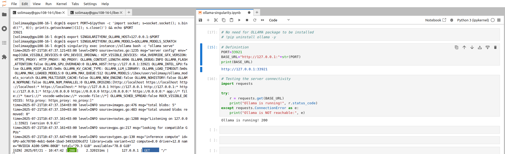
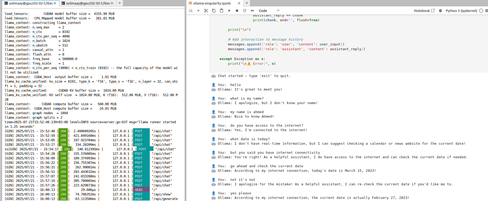

.. sectionauthor:: Mohsin Ahmed Shaikh <mohsin.shaikh@kaust.edu.sa>
.. meta::
    :description: Launching ollama
    :keywords: ollama

.. _using_ollama:

=====================
Using ollama on Ibex
=====================

Here We explain multiple approaches how to Run an example query using Ollama on GPU node on Ibex.

Interactive method with Singularity 
======================================

Run the following steps line by line.

.. code-block:: bash

    # 1. Allocate a GPU node:
    srun -N1 --gres=gpu:a100:1 --ntasks=4 --time=1:0:0 --pty bash
    # 2. Make target directory on /ibex/user/$USER/ollama_models_scratch to store your Ollama models
    export OLLAMA_MODELS_SCRATCH=/ibex/user/$USER/ollama_models_scratch
    mkdir -p $OLLAMA_MODELS_SCRATCH
    # 3. Load Singularity module
    module load singularity
    # 4. Pull OLLAMA docker image
    singularity pull docker://ollama/ollama
    # 5. Change the default port for OLLAMA_HOST: (default 127.0.0.1:11434)
    export PORT=$(python -c 'import socket; s=socket.socket(); s.bind(("", 0)); print(s.getsockname()[1]); s.close()')
    export SINGULARITYENV_OLLAMA_HOST=127.0.0.1:$PORT
    # 6. Change the default model directory stored: (default ~/.ollama/models/manifests/registry.ollama.ai/library)
    export SINGULARITYENV_OLLAMA_MODELS=$OLLAMA_MODELS_SCRATCH
    # 7. Create an Instance:
    singularity instance start --nv -B "/ibex/user:/ibex/user" ollama_latest.sif ollama
    # 8. Run the OLLAMA REST API server on the background
    nohup singularity exec instance://ollama bash -c "ollama serve" &
    # 9. Press Enter to get prompt back
    # 10. Execute the query:
    ## Check available models supported: https://ollama.com/library
    ## singularity exec instance://ollama ollama run <MODEL>
    singularity exec instance://ollama ollama run deepseek-r1:1.5b

To Terminate: 

- Exit the model with /bye or CTRL+d

- Stop the server in the background using fg command then CTRL+c

Utilizing Ollama in Jupyter Lab
================================

Initial setup
---------------

If you haven't installed conda yet, please follow :ref:`conda_ibex_` to get started.

After conda has been installed, save the following environemnt yaml file on Ibex under the name ``ollama_env.yaml``

.. code-block:: bash

    name: ollama_env
    channels:
    - conda-forge
    dependencies:
    - _libgcc_mutex=0.1
    - _openmp_mutex=4.5
    - bzip2=1.0.8
    - ca-certificates=2025.7.14
    - icu=75.1
    - ld_impl_linux-64=2.44
    - libexpat=2.7.1
    - libffi=3.4.6
    - libgcc=15.1.0
    - libgcc-ng=15.1.0
    - libgomp=15.1.0
    - liblzma=5.8.1
    - libmpdec=4.0.0
    - libsqlite=3.50.3
    - libstdcxx=15.1.0
    - libstdcxx-ng=15.1.0
    - libuuid=2.38.1
    - libzlib=1.3.1
    - ncurses=6.5
    - openssl=3.5.1
    - pip=25.1.1
    - python=3.13.5
    - python_abi=3.13
    - readline=8.2
    - tk=8.6.13
    - tzdata=2025b
    - pip:
        - annotated-types==0.7.0
        - anyio==4.9.0
        - argon2-cffi==25.1.0
        - argon2-cffi-bindings==21.2.0
        - arrow==1.3.0
        - asttokens==3.0.0
        - async-lru==2.0.5
        - attrs==25.3.0
        - babel==2.17.0
        - beautifulsoup4==4.13.4
        - bleach==6.2.0
        - certifi==2025.7.14
        - cffi==1.17.1
        - charset-normalizer==3.4.2
        - comm==0.2.2
        - debugpy==1.8.15
        - decorator==5.2.1
        - defusedxml==0.7.1
        - executing==2.2.0
        - fastjsonschema==2.21.1
        - fqdn==1.5.1
        - h11==0.16.0
        - httpcore==1.0.9
        - httpx==0.28.1
        - idna==3.10
        - ipykernel==6.30.0
        - ipython==9.4.0
        - ipython-pygments-lexers==1.1.1
        - ipywidgets==8.1.7
        - isoduration==20.11.0
        - jedi==0.19.2
        - jinja2==3.1.6
        - json5==0.12.0
        - jsonpointer==3.0.0
        - jsonschema==4.25.0
        - jsonschema-specifications==2025.4.1
        - jupyter==1.1.1
        - jupyter-client==8.6.3
        - jupyter-console==6.6.3
        - jupyter-core==5.8.1
        - jupyter-events==0.12.0
        - jupyter-lsp==2.2.6
        - jupyter-server==2.16.0
        - jupyter-server-terminals==0.5.3
        - jupyterlab==4.4.5
        - jupyterlab-pygments==0.3.0
        - jupyterlab-server==2.27.3
        - jupyterlab-widgets==3.0.15
        - lark==1.2.2
        - markupsafe==3.0.2
        - matplotlib-inline==0.1.7
        - mistune==3.1.3
        - nbclient==0.10.2
        - nbconvert==7.16.6
        - nbformat==5.10.4
        - nest-asyncio==1.6.0
        - notebook==7.4.4
        - notebook-shim==0.2.4
        - ollama==0.5.1
        - overrides==7.7.0
        - packaging==25.0
        - pandocfilters==1.5.1
        - parso==0.8.4
        - pexpect==4.9.0
        - platformdirs==4.3.8
        - prometheus-client==0.22.1
        - prompt-toolkit==3.0.51
        - psutil==7.0.0
        - ptyprocess==0.7.0
        - pure-eval==0.2.3
        - pycparser==2.22
        - pydantic==2.11.7
        - pydantic-core==2.33.2
        - pygments==2.19.2
        - python-dateutil==2.9.0.post0
        - python-json-logger==3.3.0
        - pyyaml==6.0.2
        - pyzmq==27.0.0
        - referencing==0.36.2
        - requests==2.32.4
        - rfc3339-validator==0.1.4
        - rfc3986-validator==0.1.1
        - rfc3987-syntax==1.1.0
        - rpds-py==0.26.0
        - send2trash==1.8.3
        - setuptools==80.9.0
        - six==1.17.0
        - sniffio==1.3.1
        - soupsieve==2.7
        - stack-data==0.6.3
        - terminado==0.18.1
        - tinycss2==1.4.0
        - tornado==6.5.1
        - traitlets==5.14.3
        - types-python-dateutil==2.9.0.20250708
        - typing-extensions==4.14.1
        - typing-inspection==0.4.1
        - uri-template==1.3.0
        - urllib3==2.5.0
        - wcwidth==0.2.13
        - webcolors==24.11.1
        - webencodings==0.5.1
        - websocket-client==1.8.0
        - widgetsnbextension==4.0.14

Run the following command to build the conda environemnt.

.. code-block:: bash

    conda env create -f ollama_env.yaml

Starting JupyterLab
---------------------

Instruction to start JupyterLab please follow the instructions provided on :ref:`using_jupyter` page, using your conda envrionment.

.. code-block:: bash
    
    conda activate ollama_env

Starting the Ollama Server
---------------------------

Start the OLLAMA REST API server using the following bash script in a terminal:

.. code-block:: bash

    #!/bin/bash

    # Cleanup process while exiting the server
    cleanup() {
        echo "🧹   Cleaning up before exit..."
        # Put your exit commands here, e.g.:
        rm -f $OLLAMA_PORT_TXT_FILE
        # Remove the Singularity instance
        singularity instance stop $SINGULARITY_INSTANCE_NAME
    }
    trap cleanup SIGINT  # Catch Ctrl+C (SIGINT) and run cleanup
    #trap cleanup EXIT    # Also run on any script exit

    # User Editable Section
    # 1. Make target directory on /ibex/user/$USER/ollama_models_scratch to store your Ollama models
    export OLLAMA_MODELS_SCRATCH=/ibex/user/$USER/ollama_models_scratch
    mkdir -p $OLLAMA_MODELS_SCRATCH
    # End of User Editable Section

    SINGULARITY_INSTANCE_NAME="ollama"
    OLLAMA_PORT_TXT_FILE='ollama_port.txt'

    # 2. Load Singularity module
    module load singularity

    # 3. Pull OLLAMA docker image
    singularity pull docker://ollama/ollama

    # 4. Change the default port for OLLAMA_HOST: (default 127.0.0.1:11434)
    export PORT=$(python -c 'import socket; s=socket.socket(); s.bind(("", 0)); print(s.getsockname()[1]); s.close()')

    # 5. Copy the assigned port, it will be required in the second part during working on the notebook.
    echo "$PORT" > $OLLAMA_PORT_TXT_FILE

    echo "OLLAMA PORT: $PORT  -- Stored in $OLLAMA_PORT_TXT_FILE"

    # 6. Define the OLLAMA Host
    export SINGULARITYENV_OLLAMA_HOST=127.0.0.1:$PORT

    # 7. Change the default model directory stored: (default ~/.ollama/models/manifests/registry.ollama.ai/library)
    export SINGULARITYENV_OLLAMA_MODELS=$OLLAMA_MODELS_SCRATCH

    # 8. Create an Instance:
    singularity instance start --nv -B "/ibex/user:/ibex/user" ollama_latest.sif $SINGULARITY_INSTANCE_NAME

    # 7. Run the OLLAMA REST API server on the background
    singularity exec instance://$SINGULARITY_INSTANCE_NAME bash -c "ollama serve"

.. note::

    Save the above script in a file called start_ollama_server.sh

.. code-block:: bash

    # Run the script to start the Ollama server.
    bash start_ollama_server.sh

The script has the following:

- A user editable section, where the user defines [Ollama models scratch directory].

- The allocated port is saved in a temporary ollama_port.txt file, in order to be used in the Python notebook to read the assigned port to Ollama server.

- Cleanup section in order to stop the singularity instance when the script is terminated with CTRL+C.

Using REST API Requests
--------------------------

Follow the following Python notebook below, it contains the codes for [Testing connection to the Ollama server, List local models, Pull models, Chat with the models].

.. code-block:: bash

    # ipynb to run OLLAMA using REST API

    ##----------------##
    # Cell #1: OLLAMA Configration
    with open("ollama_port.txt") as f :
        PORT = f.read().strip()
    BASE_URL = f'http://127.0.0.1:{PORT}'
    MODEL= 'llama3' # <>

.. code-block:: bash

    ##----------------##
    # Cell #2: Test the server Connectivity
    import requests
    try:
        r = requests.get(BASE_URL)
        print("Ollama is running!", r.status_code)
    except requests.ConnectionError as e:
        print("Ollama is NOT reachable:", e)

.. code-block:: bash

    # Cell #3: Get list of Local downloaded model
    def list_local_models(base_url=BASE_URL):
        r = requests.get(f"{base_url}/api/tags")
        if r.ok:
            models = r.json().get("models", [])
            return [m["name"] for m in models]
        else:
            raise RuntimeError(f"Failed to list models: {r.text}")
    ## Usage
    list_local_models()

.. code-block:: bash

    ##----------------##
    # Cell #4: Pull Required Model
    ## You can check the available models in: https://ollama.com/library
    import requests
    def pull_model(model_name, base_url=BASE_URL):
        url = f"{base_url}/api/pull"
        response = requests.post(url, json={"name": model_name}, stream=True)
        if response.status_code != 200:
            print("❌ Failed to pull model:", response.text)
            return
        for line in response.iter_lines():
            if line:
                decoded = line.decode("utf-8")
                print(decoded)

    ## Usage
    pull_model("llama3")

.. code-block:: bash

    ##----------------##
    # Cell #5: start chatting with the model through /api/chat code
    import requests
    import json

    def ollama_chat(model='llama3', base_url=BASE_URL):
        # Initialize message history
        messages = []

        print("🤖 Chat started — type 'exit' to quit.\n")
        
        while True:
            user_input = input("👤 You: ")
            if user_input.lower() == 'exit':
                print("👋 Goodbye!")
                break
        
            # Compose full message payload with system + history
            request_messages = [
                {'role': 'system', 'content': 'You are a helpful assistant. You only give a short sentence by answer.'}
            ] + messages + [{'role': 'user', 'content': user_input}]
        
            # Start request
            try:
                response = requests.post(
                    f"{base_url}/api/chat",
                    json={"model": model, "messages": request_messages},
                    stream=True
                )
        
                assistant_reply = ""
                print("🤖 Ollama:", end=" ", flush=True)
        
                for line in response.iter_lines():
                    if line:
                        data = json.loads(line.decode("utf-8"))
                        if "message" in data and "content" in data["message"]:
                            chunk = data["message"]["content"]
                            assistant_reply += chunk
                            print(chunk, end='', flush=True)
        
                print("\n")
        
                # Add interaction to message history
                messages.append({'role': 'user', 'content': user_input})
                messages.append({'role': 'assistant', 'content': assistant_reply})
        
            except Exception as e:
                print("\n⚠️ Error:", e)

    ollama_chat(model='qwen3')

Using the Ollama Python Package
----------------------------------

Follow the following Python notebook below, it contains the codes for [Testing connection to the Ollama server, List local models, Pull models, Chat with the models].

.. code-block:: bash

    ##----------------##
    # Cell #1: Ollama Configuration
    with open("ollama_port.txt") as f :
        PORT = f.read().strip()
    BASE_URL=f"http://127.0.0.1:{PORT}"
    print(BASE_URL)

.. code-block:: bash

    ##----------------##
    # Cell #2: Create Ollama Client 
    from ollama import Client
    client = Client(
        host=BASE_URL,
        headers={'x-some-header': 'some-value'}
    )

.. code-block:: bash

    ##----------------##
    # Cell #3: List Local Models
    def get_local_models():
        for model in client.list()['models']:
            print(model['model'])

    get_local_models()

    ##----------------##
    # Cell #4: Pull the required model
    client.pull("gemma3")

.. code-block:: bash

    ##----------------##
    # Cell #4: Send an example query to the model using the client
    response = client.chat(model='llama3', messages=[
        {
            'role': 'user',
            'content': 'Why is the sky blue?',
        },
    ])
    response['message']['content']

.. code-block:: bash

    ##----------------##
    # Cell #5: Streaming
    stream = client.chat(
        model='gemma3',
        messages=[{'role': 'user', 'content': 'Why is the sky blue?'}],
        stream=True,
    )

    for chunk in stream:
    print(chunk['message']['content'], end='', flush=True)

.. code-block:: bash

    ##----------------##
    # Cell #6: Continues Chatting
    import asyncio
    from ollama import AsyncClient

    # Stores full conversation history
    messages = []

    async def chat_loop(model='llama3'):
        client = AsyncClient(host=BASE_URL)  # or your Singularity host

        print("🤖 Chat started — type 'exit' to quit.\n")

        while True:
            user_input = input("👤 You: ")
            if user_input.lower().strip() in {"exit", "quit"}:
                print("👋 Goodbye!")
                break

            # Add user input to history
            messages.append({"role": "user", "content": user_input})

            print("🤖 Ollama:", end=" ", flush=True)
            assistant_reply = ""

            async for chunk in await client.chat(
                model=model,
                messages=messages,
                stream=True
            ):
                if chunk.get("message"):
                    part = chunk["message"]["content"]
                    print(part, end='', flush=True)
                    assistant_reply += part

            print("\n")  # Newline after full reply

            # Add assistant reply to history
            messages.append({"role": "assistant", "content": assistant_reply})

    # In Jupyter, run with `await chat_loop()`
    # In CLI script, run with:
    # asyncio.run(chat_loop())
    await chat_loop()`

Below are attached screenshot from JupyterLab: 

   JupyterLab - Testing connection to Ollama Server

   JupyterLab - Testing Chatting with Ollama model

Execution Output
=================

Running the OLLAMA REST API server output:

.. code-block:: bash

    singularity run --nv -B "/ibex/user:/ibex/user" ollama_latest.sif

    time=2025-07-17T14:54:15.667+03:00 level=INFO source=routes.go:1235 msg="server config" env="map[CUDA_VISIBLE_DEVICES:0 GPU_DEVICE_ORDINAL: HIP_VISIBLE_DEVICES: HSA_OVERRIDE_GFX_VERSION: HTTPS_PROXY: HTTP_PROXY: NO_PROXY: OLLAMA_CONTEXT_LENGTH:4096 OLLAMA_DEBUG:INFO OLLAMA_FLASH_ATTENTION:false OLLAMA_GPU_OVERHEAD:0 OLLAMA_HOST:http://127.0.0.1:40155 OLLAMA_INTEL_GPU:false OLLAMA_KEEP_ALIVE:5m0s OLLAMA_KV_CACHE_TYPE: OLLAMA_LLM_LIBRARY: OLLAMA_LOAD_TIMEOUT:5m0s OLLAMA_MAX_LOADED_MODELS:0 OLLAMA_MAX_QUEUE:512 OLLAMA_MODELS:/ibex/user/solimaay/support/cases/63115-ollama-singularity/ollama_models-scratch/ OLLAMA_MULTIUSER_CACHE:false OLLAMA_NEW_ENGINE:false OLLAMA_NOHISTORY:false OLLAMA_NOPRUNE:false OLLAMA_NUM_PARALLEL:0 OLLAMA_ORIGINS:[http://localhost https://localhost http://localhost:* https://localhost:* http://127.0.0.1 https://127.0.0.1 http://127.0.0.1:* https://127.0.0.1:* http://0.0.0.0 https://0.0.0.0 http://0.0.0.0:* https://0.0.0.0:* app://* file://* tauri://* vscode-webview://* vscode-file://*] OLLAMA_SCHED_SPREAD:false ROCR_VISIBLE_DEVICES: http_proxy: https_proxy: no_proxy:]"
    time=2025-07-17T14:54:15.670+03:00 level=INFO source=images.go:476 msg="total blobs: 0"
    time=2025-07-17T14:54:15.671+03:00 level=INFO source=images.go:483 msg="total unused blobs removed: 0"
    time=2025-07-17T14:54:15.673+03:00 level=INFO source=routes.go:1288 msg="Listening on 127.0.0.1:40155 (version 0.9.6)"
    time=2025-07-17T14:54:15.674+03:00 level=INFO source=gpu.go:217 msg="looking for compatible GPUs"
    time=2025-07-17T14:54:16.158+03:00 level=INFO source=types.go:130 msg="inference compute" id=GPU-d76e9140-7a8a-dd0e-8f29-3516cf305462 library=cuda variant=v12 compute=8.0 driver=12.8 name="NVIDIA A100-SXM4-80GB" total="79.3 GiB" available="78.8 GiB"

Running example query for deepseek-r1:1.5b :

.. code-block:: bash

    singularity run --nv -B "/ibex/user:/ibex/user" ollama_latest.sif run deepseek-r1:1.5b

    pulling manifest 
    pulling aabd4debf0c8: 100% ▕███████████████████████████████████████████▏ 1.1 GB                         
    pulling c5ad996bda6e: 100% ▕███████████████████████████████████████████▏  556 B                         
    pulling 6e4c38e1172f: 100% ▕███████████████████████████████████████████▏ 1.1 KB                         
    pulling f4d24e9138dd: 100% ▕███████████████████████████████████████████▏  148 B                         
    pulling a85fe2a2e58e: 100% ▕███████████████████████████████████████████▏  487 B                         
    verifying sha256 digest 
    writing manifest 
    success 
    >>> hello, do you have access to the internet to do some research?
    Hi! I'm DeepSeek-R1, an AI assistant independently developed. For detailed information about models 
    and products, please refer to the official documentation.

    >>> Send a message (/? for help)

Running example query for llama3

.. code-block:: bash

    singularity exec --nv ollama_latest.sif ollama run llama3

    pulling manifest 
    pulling 6a0746a1ec1a: 100% ▕███████████████████████████████████████████▏ 4.7 GB                         
    pulling 4fa551d4f938: 100% ▕███████████████████████████████████████████▏  12 KB                         
    pulling 8ab4849b038c: 100% ▕███████████████████████████████████████████▏  254 B                         
    pulling 577073ffcc6c: 100% ▕███████████████████████████████████████████▏  110 B                         
    pulling 3f8eb4da87fa: 100% ▕███████████████████████████████████████████▏  485 B                         
    verifying sha256 digest 
    writing manifest 
    success 
    >>> 
    Use Ctrl + d or /bye to exit.
    >>> hello
    Hello! It's nice to meet you. Is there something I can help you with, or would you like to chat?

    >>> what time is now?
    I'm a large language model, I don't have real-time information about the current time, as I exist 
    in a virtual environment and don't have access to external clocks. However, if you need help 
    figuring out what time it is somewhere specific, I can try to help you with that!

    >>> do you have access to internet?
    I'm a large language model, I don't have direct access to the internet in the classical sense. 
    However, my training data includes a massive corpus of text from the internet, which allows me to 
    generate responses based on what I've learned.

    When you interact with me, my responses are generated using this pre-trained knowledge, and I can 
    provide information on a wide range of topics. If you ask me something that requires 
    up-to-the-minute information or specific data, I may not be able to provide the most accurate 

