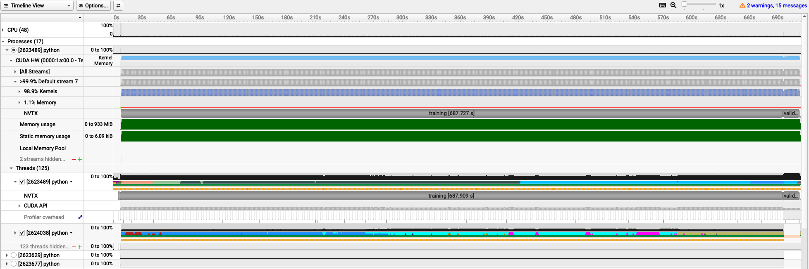

.. sectionauthor:: Kadir Akbudak <kadir.akbudak@kaust.edu.sa>
.. meta::
    :description: Profiling a single-GPU PyTorch training workload using NVIDIA Nsight Systems
    :keywords: profile, profiling, gpu, nsight, nvtx, pytorch

.. _profile_pytorch_single_gpu_nsight_:

============================================================================
Profiling a single-GPU PyTorch training workload using NVIDIA Nsight Systems
============================================================================

This guide demonstrates how to profile a PyTorch training workload running on a single GPU using NVIDIA Nsight Systems. Profiling helps identify performance bottlenecks and optimize the training process. While this example uses a single V100 GPU on the IBEX cluster, the same approach applies to other NVIDIA GPUs.

Here is a sample PyTorch training script (``singlegpu.py``) that trains an image classifier on the Tiny ImageNet dataset using a single GPU. The script includes NVTX ranges to mark different sections of the code for profiling.

.. code-block:: python

    # Functions for capturing time elapsed
    import time, gc

    # Timing utilities
    start_time = None

    def start_timer():
        global start_time
        gc.collect()
        if device == "cuda":
            torch.cuda.empty_cache()
            torch.cuda.reset_max_memory_allocated()
            torch.cuda.synchronize()
        start_time = time.time()

    def end_timer_and_print(local_msg):
        if device == "cuda":
            torch.cuda.synchronize()
        end_time = time.time()
        print("\n" + local_msg)
        print("Total execution time = {:.3f} sec".format(end_time - start_time))
        print(
            "Max memory used by tensors = {} bytes".format(
                torch.cuda.max_memory_allocated()
            )
        )

    import torch, datetime, os

    # Essential packages for training an image classifier in PyTorch
    import torch.nn.functional as F
    import torch.nn as nn
    import torch.optim as optim
    import torch.backends.cudnn as cudnn
    from torch.cuda import amp

    import torchvision
    import torchvision.transforms as transforms
    import matplotlib.pyplot as plt
    import numpy as np

    import torch.cuda.nvtx as nvtx

    torch.manual_seed(43)
    cudnn.deterministic = True
    cudnn.benchmark = False

    # import and instantiate tensorboard for monitoring model performance
    from torch.utils.tensorboard import SummaryWriter

    nodes = 1
    gpus = 0
    num_workers = 8
    batch_size = 64
    epochs = 1
    lr = 1e-2
    momentum = 0.9
    weight_decay = 5e-4
    print_interval = 100

    def accuracy(outputs, labels):
        preds = outputs.argmax(dim=1)
        return torch.sum(preds == labels).item()

    with nvtx.range("dataprep"):
        # Prepare training data
        normalize = transforms.Normalize(
            mean=[0.485, 0.456, 0.406], std=[0.229, 0.224, 0.225]
        )
        train_transform = transforms.Compose(
            [
                transforms.RandomResizedCrop(224),
                transforms.RandomHorizontalFlip(),
                transforms.ToTensor(),
                normalize,
            ]
        )

        val_transform = transforms.Compose(
            [
                transforms.Resize(256),
                transforms.CenterCrop(224),
                transforms.ToTensor(),
                normalize,
            ]
        )

        datadir = os.environ["DATA_DIR"]
        trainset = torchvision.datasets.ImageFolder(
            root=os.path.join(datadir, "train"), transform=train_transform
        )
        trainloader = torch.utils.data.DataLoader(
            trainset,
            batch_size=batch_size,
            shuffle=True,
            num_workers=num_workers,
            pin_memory=True,
            drop_last=False,
        )

        valset = torchvision.datasets.ImageFolder(
            root=os.path.join(datadir, "val"), transform=val_transform
        )
        valloader = torch.utils.data.DataLoader(
            valset,
            batch_size=batch_size,
            shuffle=False,
            num_workers=num_workers,
            pin_memory=True,
            drop_last=False,
        )

    #with torch.autograd.profiler.emit_nvtx():
    if True:
        # Pre-training
        net = torchvision.models.resnet50(weights=None, num_classes=200)
        # Transfer learning
        # net=torchvision.models.resnet50(weights=torchvision.models.ResNet50_Weights.IMAGENET1K_V2)

        if torch.cuda.is_available():
            device = "cuda"
            print(device)
            net.cuda(torch.cuda.current_device())
        else:
            device = "cpu"

        print(device)
        criterion = nn.CrossEntropyLoss().to(device)
        optimizer = optim.SGD(
            net.parameters(), lr=lr, momentum=momentum, weight_decay=weight_decay
        )
        scaler = amp.GradScaler()
        net.to(device)
        print("Starting the training")
        start_timer()
        writer = SummaryWriter("logs/experiment_%s" % (os.environ.get("SLURM_JOBID", "default")))
        for epoch in range(epochs):  # loop over the dataset multiple times
            with nvtx.range("training"):
                # Train loop
                net.train()
                train_loss = 0.0
                for i, data in enumerate(trainloader):
                    # get the inputs; data is a list of [inputs, labels]
                    inputs = data[0].to(device, non_blocking=True)
                    labels = data[1].to(device, non_blocking=True)

                    # zero the parameter gradients
                    optimizer.zero_grad()

                    # forward + backward + optimize
                    with torch.cuda.amp.autocast(enabled=True, dtype=torch.float32):
                        outputs = net(inputs)
                        loss = criterion(outputs, labels)
                    scaler.scale(loss).backward()
                    scaler.step(optimizer)
                    scaler.update()
                    train_loss += loss.item()

                train_loss = train_loss / len(trainloader.dataset.targets)
                writer.add_scalar("Loss/train", train_loss, epoch)

            with nvtx.range("validation"):
                # Validation loop ( we won't backprop and optimize since this step is not training the model)
                net.eval()
                val_loss = 0.0
                for i, data in enumerate(valloader):
                    # get the inputs; data is a list of [inputs, labels]
                    inputs = data[0].to(device, non_blocking=True)
                    labels = data[1].to(device, non_blocking=True)
                    with torch.no_grad():
                        outputs = net(inputs)
                        loss = criterion(outputs, labels)
                    val_loss += loss.item()
                val_loss = val_loss / len(valloader.dataset.targets)
                writer.add_scalar("Loss/val", val_loss, epoch)
                print(f"[{epoch + 1}] :Loss (train, val):{train_loss:.3f}, {val_loss:.3f}")
                writer.flush()

    with nvtx.range("savemodel"):
        end_timer_and_print("Finished Training")
        writer.close()
        PATH = "./tiny_imagenet.pth"
        torch.save(net.state_dict(), PATH)

To profile the above PyTorch training script using NVIDIA Nsight Systems, you can use the following SLURM script (``singlegpu.slurm``) on IBEX:

.. code-block:: slurm

    #!/bin/bash

    #SBATCH --time=00:30:00
    #SBATCH --nodes=1
    #SBATCH --ntasks=1
    #SBATCH --ntasks-per-node=1
    #SBATCH --gpus=1
    #SBATCH --gpus-per-node=1
    #SBATCH --constraint=v100
    #SBATCH --cpus-per-task=8

    module load dl
    module load pytorch
    module load nvidia-sdk/nvhpc/25.9
    export DATA_DIR=/ibex/ai/reference/CV/tinyimagenet
    cmd="python singlegpu.py"
    nsys profile --force-overwrite true --cuda-memory-usage=true --trace=cuda,nvtx  --export=sqlite --output profile.${SLURM_JOBID} ${cmd} 2>&1 | tee output.txt

The above SLURM script can be submitted to the IBEX cluster using the following command:

.. code-block:: bash

    sbatch singlegpu.slurm

After the job completes, you will find a profiling report file named ``profile.<SLURM_JOBID_OF_YOUR_JOB>.nsys-rep`` in your working directory. You can open this report using NVIDIA Nsight Systems GUI on your local machine to analyze the profiling data.

The following trace is obtained for ``batch_size=64``. It shows you various NVTX ranges that were added in the PyTorch script, allowing you to see the time spent in data preparation, training, validation, and model saving phases. If you uncomment the line with ``#with torch.autograd.profiler.emit_nvtx():``, you will also see detailed kernel launches in PyTorch.

.. image:: profile_pytorch_single_gpu_nsight_batch_size_64.png
   :alt: Nsight Systems Trace
   :align: center
   :width: 100%

The following trace is obtained for ``batch_size=4``.

On IBEX cluster, GPU performance metrics are automatically collected using NVIDIA Data Center GPU Manager (DCGM) during the execution of a SLURM job. After the job completes, you can check the collected GPU statistics saved under the ``dcgm`` directory. 

The following output belongs to ``batch_size=64`` job:

.. code-block:: bash

    $ cat dcgm/singlegpu.slurm/43673584/dcgm-gpu-stats-gpu214-14-43673584.out
    Successfully retrieved statistics for job: 43673584.
    +------------------------------------------------------------------------------+
    | GPU ID: 6                                                                    |
    +====================================+=========================================+
    |-----  Execution Stats  ------------+-----------------------------------------|
    | Start Time                         | Mon Jan  5 15:32:18 2026                |
    | End Time                           | Mon Jan  5 15:39:41 2026                |
    | Total Execution Time (sec)         | 442.62                                  |
    | No. of Processes                   | 1                                       |
    +-----  Performance Stats  ----------+-----------------------------------------+
    | Energy Consumed (Joules)           | 89504                                   |
    | Power Usage (Watts)                | Avg: 208.35, Max: 304.634, Min: 42.394  |
    | Max GPU Memory Used (bytes)        | 7409238016                              |
    | SM Clock (MHz)                     | Avg: 1228, Max: 1530, Min: 135          |
    | Memory Clock (MHz)                 | Avg: 877, Max: 877, Min: 877            |
    | SM Utilization (%)                 | Avg: 72, Max: 99, Min: 0                |
    | Memory Utilization (%)             | Avg: 47, Max: 67, Min: 0                |
    +------------------------------------------------------------------------------+

The following output belongs to ``batch_size=4`` job:

.. code-block:: bash

    $ cat dcgm/singlegpu.slurm/43674721/dcgm-gpu-stats-gpu213-14-43674721.out
    Successfully retrieved statistics for job: 43674721.
    +------------------------------------------------------------------------------+
    | GPU ID: 3                                                                    |
    +====================================+=========================================+
    |-----  Execution Stats  ------------+-----------------------------------------|
    | Start Time                         | Mon Jan  5 16:32:39 2026                |
    | End Time                           | Mon Jan  5 16:54:49 2026                |
    | Total Execution Time (sec)         | 1329.78                                 |
    | No. of Processes                   | 1                                       |
    +-----  Performance Stats  ----------+-----------------------------------------+
    | Energy Consumed (Joules)           | 156500                                  |
    | Power Usage (Watts)                | Avg: 119.23, Max: 195.217, Min: 41.848  |
    | Max GPU Memory Used (bytes)        | 1394606080                              |
    | SM Clock (MHz)                     | Avg: 910, Max: 1530, Min: 135           |
    | Memory Clock (MHz)                 | Avg: 877, Max: 877, Min: 877            |
    | SM Utilization (%)                 | Avg: 43, Max: 83, Min: 0                |
    | Memory Utilization (%)             | Avg: 15, Max: 30, Min: 0                |
    +------------------------------------------------------------------------------+

Comparing the two runs, you can observe that decreasing the batch size leads to lower GPU utilization (``SM Utilization (%)`` in the DCGM output) and memory usage (``Memory Utilization (%)`` in the DCGM output), resulting in a less efficient training process.
GPU and memory utilization throughout the execution time of the job can also be observed in the Nsight Systems trace.
This profiling information can help you make informed decisions about optimizing your PyTorch training workloads on NVIDIA GPUs. 