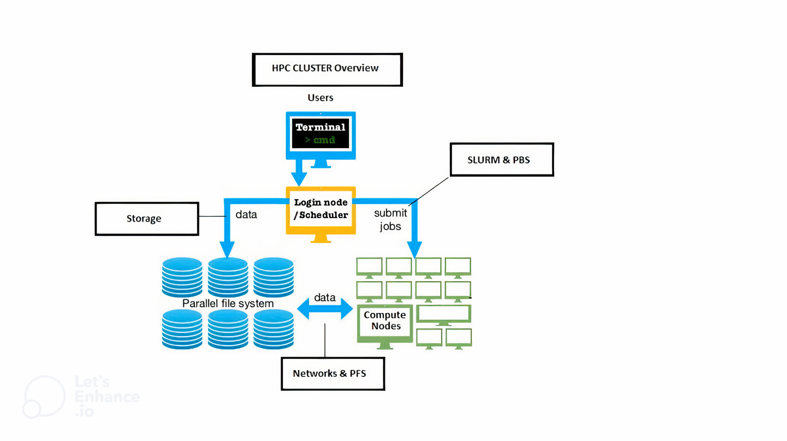

.. sectionauthor:: Mohsin Ahmed Shaikh <mohsin.shaikh@kaust.edu.sa>
.. meta::
    :description: Available systems at KSL
    :keywords: Shaheen3, Ibex, post-processing, hardware, filesystems, operating system
    
.. _available_systems:

====================
Hardware ecosystem
====================
KAUST Supercomputing Lab operates multiple High performance computing platforms for its users. 
These platforms differ in the resources they offer, the use cases they enable, the policies users need to adhere to, and the peak performance they are capable of.

To get the most out of their allocations, users are highly encouraged to read the technical documentation and attend relevant user trainings.

.. note::
   Resources on KSL systems are free of charge for research purpose, unless otherwise stipulated. Please consult the :email:`KSL support staff <help@hpc.kaust.edu.sa` for more information and clarification in this regard. 

This section of support documentation elaborates the technical details of the KSL HPC platforms. 
Here, users can expect detailed technical information about the architecture of each KSL systems. Please navigate to the specific system for these details. But before diving in the specifics, let's understand what a supercomputer is composed of on a high level.

.. toctree::
   :titlesonly:
   :maxdepth: 1
   :hidden:
   
   shaheen3/index
   ibex/index

An abstract Supercomputer
-------------------------

A High-Performance Computing (HPC) cluster is a pool of interconnected computing servers which run large-scale scientific computing simulations. 
If a massive number of these computing servers are connected via a High-Speed Network (HSN) in specific topologies to enable communication with extremely low latency and high bandwidth to the farthest compute servers, such HPC clusters are characterized as Supercomputers.  

These compute servers are called **compute nodes**. They are connected via HSN, which enables scalability to run a single scientific application on very large CPUs and GPUs. The HPC-grade workloads generally come from domains such as Computational Fluid Dynamics, Earth Sciences, Weather and Climate models, Computational Chemistry, Bioinformatics, and, more recently, Artificial Intelligence.

In order to make it more efficient, the operating system installed on a compute node is lightweight and runs only necessary processes and services to enable its fundamental functions. This makes them less *general-purpose* than an average CPU on a workstation or laptop.
The compute nodes of HPC clusters and Supercomputers consist of a significant number of very capable, sometimes specialized, compute units, large amounts of high bandwidth memory and infrastructure to support their running, e.g. specialized power supplies and cooling systems. 

A user is never expected to log directly onto a compute node. Specialized nodes are available for this task, called **login nodes**. As the name suggests, these exist primarily for a user to log in and perform only the interactive tasks, e.g. file listing and editing, submitting jobs to schedulers, compiling and linking applications, etc.
These are generally shared among users, and, as a responsible citizen, a user is expected to *refrain* from running compute and memory-intensive processes on a login node. *System administration may notify to warn such users and hold the authority to even suspend access to repeat offenders.*

Reading and writing (a task called file I/O) into files is a common step in the runtime life of any application/workload. On a workstation/laptop, a process generally reads and writes serially into a single mount point on a filesystem. This implies that other processes wanting to do file I/O will need to wait until the preceding process finishes.     
 
A **parallel filesystem**, as opposed to a serial filesystem, distributes large data on multiple storage targets (disk drives for simplicity). Being an integral part of an HPC cluster, parallel filesystems are accessible from both login and compute nodes. The storage targets collectively make the total storage capacity of a parallel filesystem. With this approach, a filesystem can scale to several Petabytes (PB). Among other file I/O formats, these filesystems support the POSIX standard of file I/O, which implies that general-purpose applications/workloads can read and write data without exceptions.
The advantage of having the data distributed over a pool of *disks* is that multiple I/O clients (applications reading and writing data) can experience a similar speed of I/O operation. Additionally, having a parallel filesystem enables applications to exploit their parallel architecture and read/write files using parallel file I/O standards such as MPI-IO, HDF5, NetCDF, ADIOS, etc., to achieve higher bandwidth (large amounts of I/O in one go) at low latency (at microseconds scale to perform a single I/O operation). 

.. note::
   Some parallel filesystems provide longer residence time for users' data and are also backed up. The others allow a shorter lifetime and are considered a *scratch* space for workloads. Please consult the :ref:`policies` section for respective KSL platform for more details.

High-speed network (HSN), which connects the compute nodes to each other and to the parallel filesystem, enables data movement at a very high speed. There are various topologies in which the compute nodes are connected to each other via HSN and are detrimental to the scalability of an HPC cluster. 

A **Job Scheduler** is a tool which allows users to prescribe the computational resources required by their HPC workload during runtime, the duration they are required for, and how the resources are used when they are available. This scripted workflow of requests and actions is termed a **job**. Users write their *jobscripts*, save them on location in a *parallel filesystem* and *submit* them to the *job scheduler* from the *login node*. The scheduler then schedules this job to run at a specific time on a specific set of compute resources, fulfilling the request by the user. Once runs are finished, results are written on the prescribed location of the parallel filesystem where users can inspect them.   

Together, all the above components combine to create a HPC cluster or a Supercomputer.

`Top500 <https://www.top500.org/>`_ is a list of top Supercomputers in the world. It is updated biannually and is considered as a menifestation of the techological advancement in making of Supercomputers. Supercomputing sites submitting their results adhere to a set of rules and run a standard workload called High Performance Linpack, a linear algerba benchmark solving a very large system of linear equations. The benchmark reports a metric/socre with units called FLOPs (FLoating point Operations in a second), which represents the speed of a supercomputer. Previous and current KAUST Supercomputers, codename **SHAHEEN**, have made to this list and we continue our commitment to achieve a high rank on `Top500 <https://www.top500.org/>`_ with future procurements. 

Choosing the right KSL system for your workload
-----------------------------------------------
There are several factors users must consider before choosing the right KSL platform for their HPC workload.

* **Organizational Association:** Some KSL systems are open for access to external (non-KAUST) users, but others aren't. Please go through `how to get an account on KSL systems <https://www.hpc.kaust.edu.sa/content/chapter-2-getting-account>`_.
* **Computational requirement:** Know if application is scalable and requires large number of CPUs and/or GPUs. In such case, *Shaheen* scale may be more appropriate to run your scientific workload
* **Licensing requirement:** If your application requires license to use, please :email:`contact KSL support staff <help@hpc.kaust.edu.sa` to inquire about your eligibility. 
* **Wall time requirement:** Wall time is the duration of a job you expect to run on a KSL system without interuption. Wall times have hard limits on different KSL systems. Please check :ref:`policies` section for details on specific KSL systems.