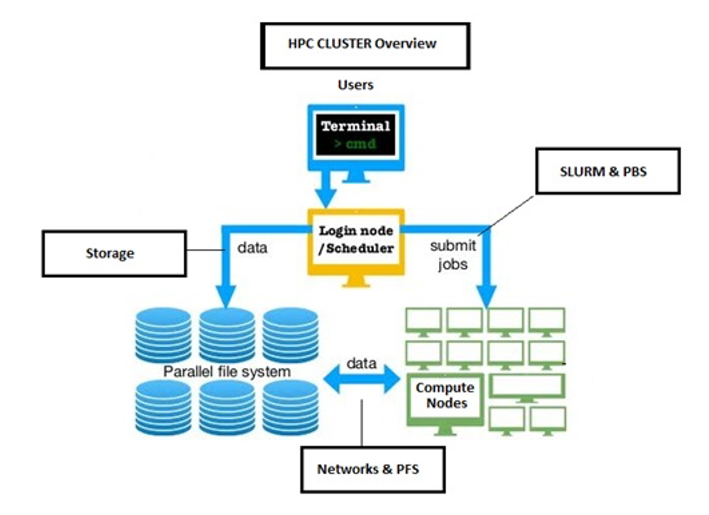

==================
Available Systems
==================
This is the landing page for description of KSL systems. This page describes an abstract HPC cluster and its expected components. Lays out the glossary and definitions.

.. toctree::
   :titlesonly:
   :maxdepth: 1
   :hidden:
   
   shaheen2/index
   shaheen3/index
   neser/index
   ibex/index

An abstract supercomputer
-------------------------

- an illustration of a supercomputer
- different components discribed here
- what are PetaFLOPs
- considerations when choosing a KSL system for your workload
  
What KSL has
------------

- CPUs, GPUs, shared filesystem, tape storage
- Where do we stand in the world
- What did we have before Shaheen 3

