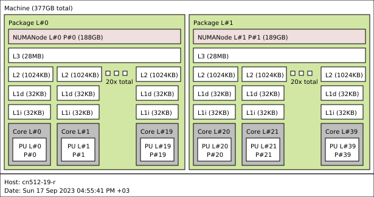
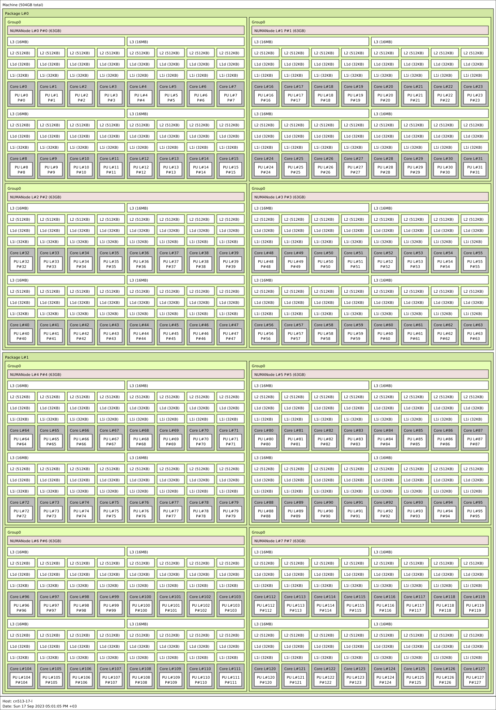

.. sectionauthor:: Mohsin Ahmed Shaikh <mohsin.shaikh@kaust.edu.sa>
.. meta::
    :description: CPU architecture on KSL systems
    :keywords: CPU, cache, Shaheen III, Ibex, AMD, Intel, Skylake, Cascade Lake, Rome, Genoa
    
.. _cpu_arch_tech_article:

==========================================
Available CPU architecture on KSL systems
==========================================
This page provides a gentle introduction to the modern CPU architecture optimized for HPC workloads. The CPUs are grouped by the KSL systems they are available on, and in which partitions. 

CPUs on Shaheen III
=====================

AMD Genoa
----------

CPUs on Ibex
=============

Intel Skylake
--------------
These are the oldest generation of Intel CPUs in the Ibex cluster. 
The nodes have two Intel Skylake processors, one in each socket, represented as *Package* in the :ref:`ibex_skylake`. 
Each processes has 20 physical cores, i.e. 40 cores in total on the node. 
The total memory available for use is approximately 350GB and has 6 memory channels per socket.

.. _ibex_skylake:

  
  Illustration of an Intel Skylake compute node of Ibex cluster

This node has two Non Uniform Memory Access (NUMA) nodes. This implies that `core 0` can access data resident on a memory device/DIMM closed to Package L#1, but will have a latency hit. Deep dive to understand more about :ref:`NUMA architecture <numa_tech_article>` and its implications on applications running on such node. 

The L3 or *Last Level Cache* is coherent across all the nodes which implies that if a `core` changes a memory location in L3, it will be visible to all cores. This does not apply to L1 and L2 caches which are local to each core. More discussion :ref:`here on Memory hierarchy on CPUs <memory_hierarchy_cpu_tech_article>`.
 
The motherboard on this node have PCIe version 3.0 which has a maximum overall throughput of 32GB/s.

From a performance point of view, this node is capable of achieving, **### GFLOPS** of `High Performance Linpack (HPL) <https://www.top500.org/project/linpack/>`_ and a peak memory bandwidth of **### GB/s** measured using `STREAM Triad <https://www.cs.virginia.edu/stream/ref.html>`_ benchmark.

These processors can run programs compiled for `x86_64` instruction set. Intel Skylake processor supports `Advance Vector Extension -- AXV2` instructions for vectorization. Some scientific applications can benefit from this feature and can see significant performance gains. Please refer to :ref:`vectorization_cpu_tech_article` for more information about this topic. 

Intel Cascade Lake
------------------
Ibex cluster has 106 compute nodes of with Intel Cascade Lake processors. These are the more modern generation compared to Skylake CPUs.  
Each node of this type has two Intel Cascade Lake processors, one in each socket, represented as *Package* in the :ref:`ibex_cascadelake`. 
Each processes has 20 physical cores, i.e. 40 cores in total on the node. 
The total memory available for use is approximately 350GB/s and has 6 memory channels per socket.  

.. _ibex_cascadelake:

  
  Illustration of an Intel Cascade Lake compute node of Ibex cluster

As in the case of Skylake these nodes have 2 NUMA nodes. Here too, the L3 cache is coherent among all cores. 

The motherboard on this node have PCIe version 3.0 which has a maximum overall throughput of 32GB/s.

There nodes are capable of achieving **### GFLOPS** of `High Performance Linpack (HPL) <https://www.top500.org/project/linpack/>`_ and a peak memory bandwidth of **### GB/s** measured using `STREAM Triad <https://www.cs.virginia.edu/stream/ref.html>`_ benchmark.

Intel Cascade Lake supports AVX2 and some AVX512 instruction sets. Additionally, Cascade Lake processors introduced a specialized instruction set called **Vectorized Neural Network Instructions (VNNI)** which accelerates neural network inference on CPUs. Developers can leverage these features by relying on using Intel MKL-DNN, Intel optimized PyTorch or Tensorflow installations. 

AMD Rome 
---------
Ibex cluster has 108 nodes with dual socket AMD Rome processors. 
The microarchitecture of AMD Rome is different than the Intel processors mentioned above. This has performance implications which the users might want to consider when choosing to run applications on these processors. 

.. _ibex_amd_rome_ccd:
.. figure:: ../static/AMD-rome-ccd.png
  :alt: CCD design of AMD Rome processors 

  CCD design of AMD Rome processors

AMD Rome processor is composed of a compute unit called *Core CompleX (CCX)*. A single CCX is composed of 4 cores. 2 CCX units create a building block called a *Core Complex Die (CCD)*. This CCD block (i.e. 8 cores) has its own L1 to L3 cache hierarchy. Each CCD has a 32MB large L3 cache. 8 CCDs make up a full processor, with 64 cores and aggregate L3 cache of 256MB. 

Additionally, each CCD has a specialized communication unit called *Infinity fabric* which provides means to access memory. There are a total of 8 memory channels (1 per CCD). For superior memory access performance, these nodes on Ibex have been booted with 8 NUMA nodes (4 NUMA per processor). 

  Illustration of an AMD Rome compute node on Ibex cluster

The AMD Rome compute nodes have a total of 128 cores, as it is dual socket (2 x processors) and 475GB of usable memory. The motherboard on this node have PCIe version 4.0 which has a maximum overall throughput of 64GB/s.

