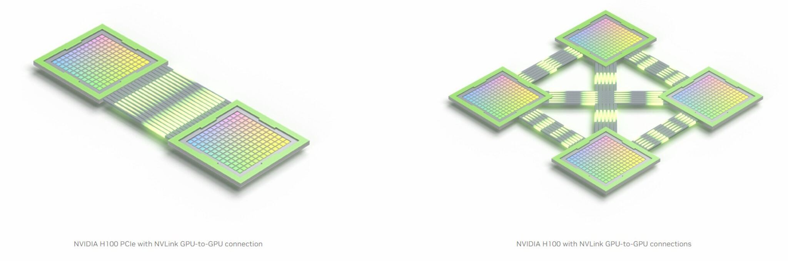

.. sectionauthor:: Mohsin Ahmed Shaikh <mohsin.shaikh@kaust.edu.sa>
.. meta::
    :description: basic GPU intro
    :keywords: CUDA, Streaming Multiprocessor
    
.. _gpu_basics_tech_article:

================================
Understanding GPU architecture
================================

In 2008, NVIDIA introduced the Tesla microarchitecture and GPUs were used as an accelerator device which was *hosted* by CPU processors on a node.  

GPU microarchitecture
----------------------
Tesla architecture unified the graphics and computing on a single compute architecture. Using NVIDIA's CUDA ( Compute Unified Device Architecture ) programming model in C and C++, developers could program these accelerators and develope accelerated applications from both graphics and compute intensive (HPC) use cases. 

On a high level, the modern GPU microarchitecture has a compute building block in hardware called **Streaming Multiprocessor (SM)**, which is a collection of simple cores, able to handle much less complex tasks than a core on a CPU and run on a slower clock frequency than a typical CPU core. The newer generations of NVIDIA GPUs build up on the same design patter as in Tesla GPUs. NVIDIA Kepler, Maxwell, Pascal, Turing, Ampere and now Hopper have increased the number of SMs in a single GPU, thus making it more massively parallel and optimized for higher throughput, with a pre-requisite for performance that the data access is contiguous to maximize the reuse of every byte brought from memory for more compute (i.e. maximum FLOPs/Byte). 

.. _gpu_basics_fig1:
.. figure:: ../static/GPU_basic.png
   :alt: CPU and GPU compute and memory hierarchy

   CPU and GPU compute and memory hierarchy -- `source1 <https://docs.nvidia.com/cuda/cuda-c-programming-guide/index.html>`_

Since there are many cores available, it is imperative to enable fast data movement to keep them busy. As of Tesla microarchitecture, GPU memory comes in two banks. One with large capacity and less bandwidth main memory and the other with very limited capacity but higher bandwidth. The later is L2 cache and is shared among all the threads run on a SM. Both the memory capacity and the bandwidth has increase with every new generation of microarchitecture. 

CUDA programming model is used to program NVIDIA GPUs. Basic execution unit which runs a sequence of operations on a data elements is called a *thread*. A finite number of threads is batched as a *block of threads*. A collection of blocks is launched together as *grid* and instance of a grid on a GPU is called a CUDA *kernel*. Several blocks of a grid can be scheduled simultaneously by the *warp* scheduler(s) on a single SM. All the threads launched on a SM can access the L2 cache and is coherent amongst them.  
In CUDA programming, data locality is paramount to achieving performance on GPUs. This is ensure by coalesced memory access and implementing Single Instruction Multiple Threads (SIMT) model of execution. These can be considered as pre-requisites for using GPUs for applications.

Therefore, from the top, a GPU workload:

#. starts on a CPU
#. CPU launches CUDA kernels on a GPU
#. For each CUDA kernel, data is moved (copied) from CPU (host) memory to GPU (device) memory over PCIe
#. The threads of each kernel compute on the data in blocks until the grid runs out.  
#. Useful data is moved back to the CPU memory for further processing

.. _nvlink:
Multi-GPU connectivity
-----------------------
Multi-GPU compute nodes is a common place on HPC systems and in cloud instances. NVIDIA connects these very capable GPUs using a proprietary interconnect call *NVLINK*. What this means that a GPU can communicate to another GPU on the same compute node without involving the CPU or its memory. This avoid unnecessary data transfer between CPUs and GPUs therefore eliminating the need of using slow PCIe route. Using NVIDIA Collective Communication Library (NCCL), applications can move data from one GPU's memory to another at a high bandwidth and low latency. This is especially significant when operations as *allreduce* happen very frequently, as in deep learning use case.   

    
    NVLink connecting multiple GPUs -- `source2 <https://blogs.nvidia.com/blog/2023/03/06/what-is-nvidia-nvlink/>`_

Different generations of NVIDIA GPUs have evolved to better bandwidth using NVLink. The table below summarizes the maximum theoretical bandwidth achievable from a generation of NVLink for hardware available on KSL systems.

.. list-table:: **NVIDIA NVLink theoretical bidirectional bandwidth**
   :widths: 30 30 30 30 30
   :header-rows: 1

   * - Version
     - bibw/ link
     - max links/ GPU
     - max bibw/ GPU
     - Topology
   * - NVLink 1.0
     - 40GB/s
     - 4
     - 160GB/s
     - Hypercube mesh
   * - NVLink 2.0
     - 50GB/s
     - 6
     - 300GB/s
     - Hybrid cube mesh
   * - NVLink 3.0
     - 50GB/s
     - 12
     - 600GB/s
     - 
   * - NVLink 4.0
     - 50GB/s
     - 18
     - 900GB/s
     - 

.. _gpurdma:
GPUDirect RDMA for multi-node communication
********************************************
There exist use cases where GPU on a single node are not enough for computing large amounts of data. In such cases, scaling to a larger number of GPUs is highly desireable. This is a common requirement on HPC clusters and Supercomputers. NVIDIA's NVLink is capable of bypassing the CPU and its memory to communicate directly via the Network Interface Cards to a a GPU on neighboring compute node. The two compute nodes are generally connected via high speed interconnect e.g. Infiniband or HPE Cray's Slingshot. Though the bandwidth is less than what is possible on NVLink between GPUs on the same node, GPUDirect RDMA circumvents the communication overhead that would otherwise would have been caused by going out via CPU over PCIe to the other compute node.  

.. figure:: ../static/gpudirect-rdma.png
    :alt: GPUDirect RDMA
    
    GPUDirect RDMA for communication between GPUs on multiple nodes -- `source3 <https://blogs.nvidia.com/blog/2023/03/06/what-is-nvidia-nvlink/>`_