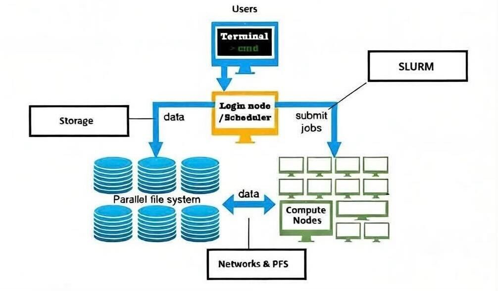
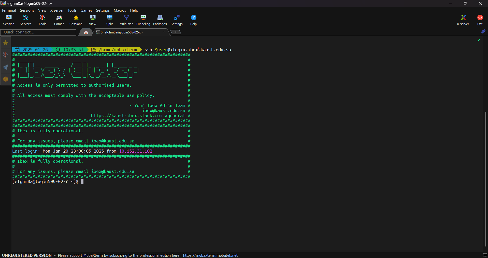
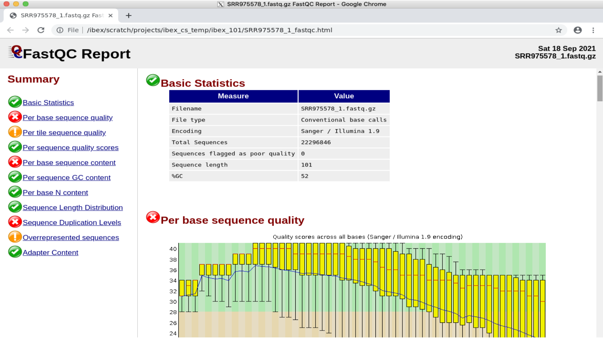

.. sectionauthor:: Ahmed Khatab <ahmed.khatab@kaust.edu.sa>
.. meta::
    :description: Ibex Training Essentials: Onboarding & Real-Time Training
    :keywords: training, onboarding

.. _ibex_101_essentials:

============================================================
Ibex 101 Essentials: Onboarding & Real-Time Training
============================================================

1. An abstract of Ibex cluster
------------------------------

2. Prerequisite to use Ibex
---------------------------

2.1 Internet connection
-----------------------

To start using Ibex you should be connected with iCampus/Uni-Fi/KAUST network or use `VPN <https://it.kaust.edu.sa/i-want-to/access-kaust-vpn>`_ when outside of KAUST network.

2.2 Terminals
-------------

Terminals are diverse, ranging from computer command-line interfaces such as Mac OS terminal, Windows Terminal and xterm. Below, we provide some examples of commonly used terminals for connecting to the Ibex cluster.

Mac OSx
---------

MacOS usually has a ``terminal`` application pre-installed. Please type Terminal in spotlight search tool to find it. 

.. image:: ../systems/static/MacOS.png
   
Open the ``terminal``, copy and paste the command for the appropriate login node you wish to access. 

.. note::
    For macOS clients, it is necessary to install `XQuartz (X11) <https://www.xquartz.org/>`_ to be able to use GUI applications.

Windows
---------

To get a ``ssh client`` application on a Windows machine, you can opt from one of the following methods:

* Download and install one of the ``ssh clients``: `PuTTY <https://www.putty.org/>`_, `MobaXTerm <https://mobaxterm.mobatek.net/download.html>`_ or `GitBash <https://git-scm.com/downloads>`_
* As an example, here is how to use `MobaXTerm on Windows <https://www.youtube.com/watch?v=xfAydE_0iQo&list=PLaUmtPLggqqm4tFTwhCB48gUAhI5ei2cx&index=19>`_ to access KSL systems.

3. How to login?
----------------

3.1 Ibex user name
-------------------

User name is your KAUST portal name and it should be in lowercase.

3.2 Different login nodes
-------------------------

The login nodes serve as the primary access point to the Ibex cluster’s computing resources and filesystems. They are intended for interactive tasks such as editing job scripts, submitting and monitoring jobs in SLURM queues, performing lightweight data analysis, and managing or transferring data across directories and filesystems. **It is not appropriate to run computationally intensive jobs on the login nodes; such workloads must be submitted to the compute nodes via the scheduler**.

Ibex cluster consists of 3 different login nodes:

To submit **CPU** only jobs, login to **ilogin**

.. code-block:: bash

    ssh -XY $USER@ilogin.ibex.kaust.edu.sa

.. note::

    ``$USER`` is your KAUST username and should be in lowercase.

To submit jobs with **GPU**, login to **glogin**

.. code-block:: bash

    ssh -XY $USER@glogin.ibex.kaust.edu.sa

If you want to access your files when editing/develop in IDE like **VS Code**, login to **vscode**

.. code-block:: bash

    ssh -XY $USER@vscode.ibex.kaust.edu.sa

.. note::
    If you're using a personal Laptop / Desktop replace ``$USER`` with your KAUST username.

4. Nomination of your principal investigator
--------------------------------------------

Each Ibex user must be associated with a Principal Investigator (PI). Users who are not associated with a PI are subject to strict limitations on the amount of compute resources they can request. Please refer the `Ibex policy <https://docs.hpc.kaust.edu.sa/policy/ibex.html>`_

User can nominate PI through `PI nomination <https://my.ibex.kaust.edu.sa/>`_

5. Ibex file systems
--------------------

5.1 Home filesystem 
--------------------

**User HOME directory**: The ``/home`` filesystem is designed for lightweight, essential user files such as shell configuration files, software rc files, and installation or setup scripts. Each user is subject to quotas on both total storage capacity and the number of files. The filesystem is accessible at ``/home/$USER``, and upon login, the session’s current working directory is set to the ``$HOME`` directory by default and **200GB** per user.

**Best practices**: Due to its limited performance and shared nature, the ``/home`` filesystem should not be used to run jobs or applications, nor to store large datasets or software installations. Computational workloads and performance-sensitive tasks must be executed from appropriate high-performance filesystems.

**Conda users**: Installing the Conda package manager, Conda environments, and related cache files in ``/home/$USER`` is strongly discouraged, as these can quickly exceed quota limits and negatively impact filesystem performance. Instead, users should install Conda and manage environments and cache files in the ``/ibex/user/$USER`` filesystem, which is better suited for such use cases.

5.2 User HPC filesystem
------------------------

``/ibex/user/$USER`` is a high performance parallel filesystem which provides storage for running your jobs and read/write data. In contrast the ``/home`` filesystem, this filesystem has low latency, high bandwidth and is capable of high I/O operations per second (IOPS). This parallel storage runs :ref:`WekaIO Filesystem <ibex_wekaio>`, they are providers of modern parallel filesystems tailored for high IOPS workloads such as AI and Bioinformatics. 

User's HPC filesystem has a capacity of **1.5TB** per users and remains for the lifetime of the user's account on Ibex. Users must manage their own files, which means if you run out of quota, there will be **no extensions to the quota** without exception. 

6. Software Environment Modulefiles
-----------------------------------

Linux modulesystem is a tool for enabling dynamically changing the environment of existing Linux shell. It is commonly used where multiple environments are expected to be used by one or multiple users. Rules can be added a modulefile and contains changes to be implemented when switching an environment from default to the desired.

A comprehensive set of software has already been optimally compiled on Ibex and made available to users via modulesystem.

module avail
-------------

To view the available modules on your HPC cluster, use the following command:

.. code-block:: bash

    module avail

**Example: On glogin node check what versions of cuda are available?**

.. code-block:: bash

    ssh -XY $USER@glogin.ibex.kaust.edu.sa
    module avail cuda

**Example: On ilogin node, check available versions of GNU compiler modules**

.. code-block:: bash

    ssh -XY $USER@ilogin.ibex.kaust.edu.sa
    module avail gcc

module load
------------

To load a module, use the module load command:

.. code-block:: bash

    module load <package-name>

**Example: On ilogin, load the GNU compiler:**

.. code-block:: bash

    ssh -XY $USER@ilogin.ibex.kaust.edu.sa
    module load gcc

When loading a specific version of the package:

.. code-block:: bash

    module load <package-name/version>

**Example: Load the Python 3.11 module:**

.. code-block:: bash

    module load python/3.11

To unload a module and revert to the default environment, use the module unload command:

.. code-block:: bash

    module unload package-name

**Example: Unload previous Python version and use Python 3.9.16:**

.. code-block:: bash

    module unload python/3.11
    module load python/3.9.16

**Example: On glogin, load the CUDA module:**

.. code-block:: bash

    ssh -XY $USER@glogin.ibex.kaust.edu.sa
    module load cuda

module list
------------

To see the modules currently loaded in your environment, use:

.. code-block:: bash

    module list

**Example:**

- Are there any modules loaded by default?
- If yes, which ones are loaded?

**Example: On ilogin node after loading openmpi module, check its version, check what other modules are loaded?**

.. code-block:: bash

    ssh -XY $USER@ilogin.ibex.kaust.edu.sa
    module load openmpi
    module list

7. SLURM
--------

SLURM is an open-source workload manager used on Linux clusters to schedule and manage jobs. It efficiently allocates computing resources such as CPUs, memory, and nodes, and controls job execution across the cluster.

During the **Ibex 101 hands-on** session, example job scripts are provided. You can copy these example job scripts to your personal workspace ``/ibex/user/$USER`` to follow along with the tutorial. Follow the steps below to copy the required job scripts.

.. code-block:: bash

    cd /ibex/user/$USER
    cp -Rf /ibex/scratch/projects/ibex_cs_temp/ibex_101  /ibex/user/$USER
    cd /ibex/user/$USER/ibex_101

7.1 Job submission
------------------

A typical jobscript has two major sections:

- SLURM Directives.

- The commands to run on allocated computational resource.

.. code-block:: bash

    cd /ibex/user/$USER/ibex_101/using-slurm

Using the script ``helloworld.sh`` which described as follows:

.. code-block:: bash

    #!/bin/bash -l
    #SBATCH --time=00:10:00
    #SBATCH --reservation=ibex101
    #SBATCH --output=%j.out
    #SBATCH --error=%j.err

    echo "helloworld"

Since we didn't specify to slurm the amount of cpus and memory needed, it will allocate the default 2GB memory with 1 CPU.

.. note::
    The reservation ``ibex101`` is used for the Hands-on session period only.

SLURM standard output / error files
-------------------------------------

When you submit a job to SLURM using a jobscript, the output and error messages are redirected to the files slurm-<jobid>.out and slurm-<jobid>.err by default.

You can specify the name for these files to include the jobid in the filename, using the following SLURM options in your jobscript.

.. code-block:: bash

    #SBATCH --output=%j.out		## Console output file
    #SBATCH --error=%j.err		## Console error file

When you submit the script using sbatch, the files will be generated as following.

.. code-block:: bash

    sbatch helloworld.sh

.. code-block:: bash

    Output:
    
    Submitted batch job 43854970

.. code-block:: bash

    ls *.out

.. code-block:: bash

    Output:
    
    43854970.out

.. code-block:: bash

    ls *.err

.. code-block:: bash

    Output:
    
    43854970.err

7.2 Job monitoring
------------------

The ``squeue`` command shows the current jobs in the SLURM queue.

You can use ``--user`` to only show your jobs.

.. code-block:: bash

    squeue --user=$USER

**Example: Use sbatch command to submit a jobscript, then check its status.**

**Questions:**

- What is the state of your job?

- Which node is your job assigned to (if running)?

.. code-block:: bash

    cd /ibex/user/$USER/ibex_101/slurm-job-examples/gpu-jobs

Single gpu job named as ``singlegpu.sh`` to demonstrate nvidia-smi output which described as follows:

.. code-block:: bash

    #!/bin/bash -l
    #SBATCH --time=00:10:00
    #SBATCH --gpus=1
    #SBATCH --reservation=ibex101

    module load cuda/11.8
    nvidia-smi

.. note::

    GPU jobs should be submitted from ``glogin`` node.

7.3 Job accounting
------------------

The ``sacct`` command shows detailed information about past jobs, including completed, failed, or canceled jobs.

**Example: You want to view details of your completed or canceled job.**

.. code-block:: bash

    sacct --user=$USER

Add more detail by using:

.. code-block:: bash

    sacct --user=$USER --format=JobID,JobName,Partition,State,ExitCode

**Questions:**

- What is the state of your job (e.g., COMPLETED, FAILED)?

- What was the exit code of your job?

7.4 Job cancelling
------------------

The ``scancel`` command cancels a job in the SLURM queue.

.. code-block:: bash

    scancel <job_id>

**Example: Submit a job, cancel it then verify it has been removed from queue:**

.. code-block:: bash

    cd /ibex/user/$USER/ibex_101/using-slurm

Using the script ``my-jobscript.sh`` which described as follows:

.. code-block:: bash

    #!/bin/bash -l
    #SBATCH --time=00:10:00
    #SBATCH --reservation=ibex101
    #SBATCH --output=%j.out
    #SBATCH --error=%j.err

    sleep 300 #The sleep command tells the system to do nothing for the specified number of seconds.

.. code-block:: bash

    sbatch my-jobscript.sh

.. code-block:: bash

    Output:
    
    Submitted batch job 33204519

.. code-block:: bash

    scancel 33204519
    squeue --user=$USER

7.5 Example production workloads
---------------------------------

Data Science
--------------

We'll use **Jupyter** for the DS workload example.

.. code-block:: bash

    cd /ibex/user/$USER/ibex_101/application-examples/DS

- Batch job to launch **Jupyter** on Ibex

Using the file ``launch-jupyter-server.sh`` which described as follows:

.. code-block:: bash

    #!/bin/bash -l
    #SBATCH --time=00:10:00
    #SBATCH --nodes=1
    #SBATCH --gpus-per-node=1
    #SBATCH --cpus-per-gpu=2
    #SBATCH --mem=2G
    #SBATCH --reservation=ibex101
    #SBATCH --job-name=demo
    #SBATCH --output=%x-%j-slurm.out
    #SBATCH --error=%x-%j-slurm.err

    # Load environment which has Jupyter installed. It can be one of the following:
    # - Machine Learning module installed on the system (module load machine_learning)
    # - your own conda environment on Ibex
    # - a singularity container with python environment (conda or otherwise)

    # setup the environment
    module purge

    # You can use the machine learning module
    module load machine_learning/2024.01
    # or you can activate the conda environment directly by uncommenting the following lines
    #export ENV_PREFIX=$PWD/env
    #conda activate $ENV_PREFIX

    # setup ssh tunneling
    # get tunneling info
    export XDG_RUNTIME_DIR=/tmp node=$(hostname -s)
    user=$(whoami)
    submit_host=${SLURM_SUBMIT_HOST}
    port=$(python -c 'import socket; s=socket.socket(); s.bind(("", 0)); print(s.getsockname()[1]); s.close()')
    echo ${node} pinned to port ${port} on ${submit_host}

    # print tunneling instructions
    echo -e "
    ${node} pinned to port ${port} on ${submit_host}
    To connect to the compute node ${node} on IBEX running your jupyter notebook server, you need to run following two commands in a terminal 1.
    Command to create ssh tunnel from you workstation/laptop to glogin:

    ssh -L ${port}:${node}.ibex.kaust.edu.sa:${port} ${user}@glogin.ibex.kaust.edu.sa

    Copy the link provided below by jupyter-server and replace the NODENAME with localhost before pasting it in your browser on your workstation/laptop.
    " >&2

    # launch jupyter server
    jupyter ${1:-lab} --no-browser --port=${port} --port-retries=0  --ip=${node}.ibex.kaust.edu.sa

Submit the job using the ``sbatch`` command:

.. code-block:: bash

    sbatch launch-jupyter-server.sh

Once the job starts open a new terminal on your local machine and copy and paste the ssh tunnel command from the ``XXX-slurm.err`` file.

Example:

.. code-block:: bash

    ssh -L 57162:gpu214-02.ibex.kaust.edu.sa:57162 $USER@glogin.ibex.kaust.edu.sa

From the ``XXX-slurm.err`` file copy one of the lines of that start with ``http://gpuXXX-XX`` into your browser.

Now we are ready to use our Jupyter client.

Bioinformatics
---------------

We'll be using **FastQC** as an example.

.. code-block:: bash

    cd /ibex/user/$USER/ibex_101/application-examples/Bio

Using the jobscript ``fastqc.batch`` which described as follows:

.. code-block:: bash

    #!/bin/bash -l
    #SBATCH --nodes=1                       ## No. of nodes to be used
    #SBATCH --cpus-per-task=4               ## No. of threads to be used for this FastQC
    #SBATCH --job-name=QC                   ## Name of your job
    #SBATCH --output=QC.%J.out              ## Console output file
    #SBATCH --error=QC.%J.err               ## Console error file
    #SBATCH --time=01:30:00                 ## Expected execution time of your job
    #SBATCH --mem=2G                        ## Estimated memory size (e.g. more than or equal to your fastq file)
    #SBATCH --reservation=ibex101

    #fetch the dataset files
    cp -r /ibex/scratch/projects/ibex_cs_temp/ibex_101/dataset/ ./
    cd dataset

    #run the application:
    module load fastqc/0.11.8
    fastqc --threads 4 SRR975578_1.fastq.gz SRR975578_2.fastq.gz

Submit the job using the ``sbatch`` command.

.. code-block:: bash

    sbatch fastqc.batch

After the job start, it will generate out and err files, watch the status of your job console error/output

.. code-block:: bash

    more QC.17122614.err

.. code-block:: bash

    Output:
    
    Loading module for FastQC 
    FastQC 0.11.8 is now loaded
    Started analysis of SRR975578_1.fastq.gz
    Started analysis of SRR975578_2.fastq.gz
    Approx 5% complete for SRR975578_1.fastq.gz
    Approx 5% complete for SRR975578_2.fastq.gz
    Approx 10% complete for SRR975578_1.fastq.gz

Verify the job completion status and application output files

.. code-block:: bash

    cat QC.17122614.out 

.. code-block:: bash

    Output:
    
    Analysis complete for SRR975578_1.fastq.gz
    Analysis complete for SRR975578_2.fastq.gz

View the output file

.. code-block:: bash

    cd /ibex/user/$USER/ibex_101/application-examples/Bio/dataset
    google-chrome SRR975578_1_fastqc.html

.. note::
    If you get an error related to process_singleton_posix, try using the following command then try again:

    .. code-block:: bash

        rm -Rf ~/.config/google-chrome/Singleton*

8. Ibex Quiz
------------

Please access the quiz form `by clicking here <https://tinyurl.com/Ibex-Quiz>`_

9. Ibex survey
--------------

We value your feedback. Please access the survey form `by clicking here <https://tinyurl.com/Ibex-survey>`_ or scan the following QR Code:

10. Contact Us
--------------

There are multiple venues you can contact us for support and information. Before sending a support request, be sure to navigate and search the documentation for related information. 

The easiest and most efficient way is to contact Ibex support:

* Ibex cluster helpdesk   :email:`<ibex@hpc.kaust.edu.sa>`
* Ibex `Slack channel <https://kaust-ibex.slack.com/>`_      
  
As a rule of thumb, if the issue is complex to describe, please send an email for requesting support. If the question is of general nature and can be stated in a line or two,  `Slack channel <https://kaust-ibex.slack.com/>`_ is most appropriate. 
